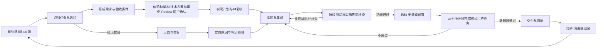

# 多角色研发流程与 Harness 建设方案

> 仓库建设与历史资料：保留当时的规划和验证背景，不作为业务项目执行时的现行协议。执行以 Skills 内维护的总纲和专业指南为准。

日期：2026-10-07。状态：规划草案。

当前建设顺序已确定为总纲、逐个职责 Agent、真实任务完整协作。共同协议以[多角色研发体系总纲](../../skills/dev-flow/references/constitution.md)为维护入口；原生配置方式见[Codex 职责 Agent 配置说明](../history/2026-10-08-codex-agent-setup.md)。本文保留整体路线与后续工具设计。

2026-10-09 用户要求先接入 Plugin，已开始建设本地分发、初始化与更新，见[插件指南](../plugin.md)。这只提前实现分发适配，不把后续运行内核或真实项目完整循环登记为已实现。

2026-10-08 当前执行偏好：六职责首版已经定义；完整功能在产品/交互/UI 和重要架构确认后，研发先输出端到端技术实现方案并经产品符合性及相关 UI/架构 AI Review，测试综合原产品与方案设计用例并 AI Review，再交用户确认。研发实施计划由 AI 复核后自主编码，通过实际端到端和架构约束检查交付；具体确认、变更及裁剪以[执行协议](../../skills/dev-flow/references/execution-contract.md)为准。

目标是建立一套可替代 superpowers 的研发协作体系，覆盖研发、产品设计、视觉设计、测试验收、运维和架构六类职责，使任务能够按实际需要推进，并交付可以使用、快速启动或已部署的成果。稳定性通过持续对焦、实际验收和状态约束实现；效率通过合理裁剪流程、共享上下文和按需并行实现。

建议采用 **一个流程入口、六个职责 Agent 及配套技能、一个轻量运行内核**，逐步形成 Plugin。六个职责及流程各部分持续建设自己的能力，每个项目维护能够支持后续研发的长期资产。先建立总纲，再逐个建设并用代表任务验证职责，继而打通 UI 与交互设计、研发测试迭代和可运行交付，最后沉淀必要内核并评估是否需要独立调度服务。

具体能力已拆分为六职责共四十八项，并定义体系各部分的持续建设、项目资产、能力成熟度和更新机制，见[研发职责具体能力与项目持续沉淀方案](2026-10-07-role-capabilities-and-project-assets.md)。这些是建设契约，当前规划并不意味着能力已经实现或经过实测。

首版执行环境已确定以 Codex 为主，核心协议保留跨工具能力。优先面向桌面与 CLI，暂按个人或小团队的多项目研发为使用场景。跨工具复用的是角色契约、任务协议和评测案例；不同宿主的工具调用、授权和调度由适配层处理。

用户已明确：现有设计和计划阶段基本可用，针对性指导可以增强，但优先级较低。首版重点补齐严肃的 UI 与交互设计、研发和测试持续来回对焦，以及部署或快速启动的准确端到端交付。协议和内核的建设应服务于这三项成果，不能先花大量成本建设抽象调度框架。

## 首版优先级和交付定义

| 优先级 | 建设内容 | 成功判据 |
| --- | --- | --- |
| 最高 | UI 与交互设计流程 | 有可执行的界面与交互契约，实际渲染和操作结果经过核验 |
| 最高 | 研发测试持续对焦 | 缺陷可复现、修复可追踪、复验针对当前候选版本，循环持续到约定验收通过 |
| 最高 | 可使用和可启动的交付 | 在干净环境启动或在目标部署环境打开，并实际完成核心用户任务 |
| 配套 | 六角色具体能力、项目沉淀和最小证据状态 | 支持交接、复验、恢复及后续资产复用，不把角色报告直接当成事实 |
| 后续 | 更有针对性的设计和计划指导 | 根据任务类型提供真正改变决策的指导，控制流程成本 |
| 后续 | 更多专业路径与长期调度 | 按真实需求扩展，并有相应实测环境和案例 |

每项研发任务入口明确交付模式：可启动源码、可安装产物、预览部署或生产部署。用户没有指定部署目标时，首版优先保证可启动交付。源码、打包产物与部署是不同验收范围，报告写明本次实际达到的范围。

本方案的主要试点以“能够启动并完成核心用户任务”为终点。仅代码已写好、单元测试通过、构建成功或页面能打开，都不足以证明这个交付目标已经达到。

## 目标和覆盖边界

“全部生命周期”包括机会识别、需求澄清、设计、实现、验证、发布、运行反馈、维护和退役。任务可以从任意适当阶段进入，并在用户要求的交付范围内结束。例如，只要求评审现有架构时，以评审成果结束；只要求提交修复时，以修复和验证结束；要求上线时，继续完成发布和运行观察。

“全部研发种类”通过可扩展的任务分类和专业配置实现。首版提供统一入口和主要任务契约，随着真实任务增加经过验证的路径。覆盖协议与实际验证能力分别标注，不能把存在一份参考文档称为已经支持某种研发工作。

研发对象应能扩展到 Web、移动端、桌面、服务端、CLI、基础设施、数据和 AI 系统；各对象需要自己的构建、验证、发布和运行配置。首版优先验证现有项目真正需要的对象。

## 方案选择

| 方案 | 适用情况 | 收益 | 成本和限制 |
| --- | --- | --- | --- |
| 纯 Skill Set | 快速验证角色与流程 | 容易迭代，宿主依赖较少 | 状态、证据和恢复主要依赖模型遵守约定 |
| Skill Set 加轻量内核，以 Plugin 分发 | 首版推荐 | 同时提供专业指导与确定性状态校验 | 需要维护小型 CLI，以及项目和宿主适配 |
| 独立服务统一调度 Agent | 需要跨会话长期队列或多用户共享状态时 | 可集中调度、记录执行和执行策略 | 需要承担服务运维、账户接入和平台兼容成本 |

先采用第二种方案。纯技能阶段是验证流程的前置步骤；独立调度服务在试点证明必要后再建设。

Plugin 可以组合 Skills 和 MCP 服务，MCP 与界面按实际需要添加；这是包装和集成能力。这里选择本地 CLI 作为首版运行工具，属于本方案的工程决策。[官方 Plugin 架构说明](https://developers.openai.com/plugins/concepts/plugins)

## 系统分层

| 层次 | 负责什么 | 主要成果 |
| --- | --- | --- |
| 流程入口 | 识别任务、风险、交付范围与适用路径 | 任务简报和流程配置 |
| 角色技能 | 按具体能力设计、实现、检查、交接并迭代方法 | 专业成果、能力契约、操作参考和评测 |
| 运行内核 | 状态转换、任务依赖、证据、资产引用、变更核验与恢复 | 运行记录、资产变化和门禁结果 |
| 项目适配 | 提供真实工程与交付配置，持续读取和维护项目能力资产 | 项目配置、资产索引、能力账本和改进待办 |
| 宿主适配 | 调用现有 Agent、工具、审批和会话能力 | Codex 等环境的适配器 |
| 评测体系 | 验证流程行为、交付质量与成本 | 固定案例、故障注入和比较报告 |

角色负责专业判断，协调者负责推进与综合，运行内核检查可机械核验的条件。运行内核不能仅凭一个文件存在，就认定需求正确或设计合理；语义验收仍需要角色判断和实际运行证据。

首版不重新实现模型推理循环、终端、浏览器和 Git。需要程序化会话控制时再评估 App Server 适配，锁定宿主版本并验证兼容性。官方 App Server 提供程序化通信协议，其 WebSocket 传输被标记为实验能力，不能直接当作稳定生产依赖。[官方 App Server 文档](https://learn.chatgpt.com/docs/app-server)

## 角色职责与交接

六个角色是六类职责。角色可以由主 Agent 承担，也可以在具有独立成果、独立上下文或并行价值时由 subagent 承担。每次任务只启用相关角色。

| 角色 | 负责的判断 | 主要输入 | 交付与退出条件 |
| --- | --- | --- | --- |
| 产品设计 | 为谁解决什么问题，范围是否有价值，用户如何完成任务 | 用户目标、现有产品、使用反馈、约束 | 用户流程、导航与交互规则、范围与非目标、可观察的验收条件；关键需求矛盾已处理 |
| 视觉设计 | 信息层级、界面状态、视觉一致性和可访问性是否成立 | 产品流程、品牌和组件规范、目标平台 | 页面或组件方案、设计 Tokens、状态呈现和必要原型；实现后检查实际渲染结果 |
| 架构 | 系统边界、接口、数据、兼容性和技术取舍是否可持续 | 当前代码结构、产品约束、质量目标 | 接口与数据契约、必要的决策记录、迁移与技术风险；实现与契约一致 |
| 研发 | 如何在既有工程中实现并集成目标行为 | 简报、设计契约、代码与工程规范 | 可审查变更、必要测试、验证记录和交接；没有把关键未完成项藏进完成声明 |
| 测试验收 | 目标行为是否成立，失败路径是否可控，证据是否对应当前成果 | 验收条件、待验版本、运行环境、原始证据 | 早期验收场景、每轮缺陷与复验、功能与质量结论；所有必需验收项有明确结果 |
| 运维 | 成果能否启动、安装、发布、运行、观察、回退和退役 | 发布物、环境约束、依赖、运行目标 | 启动与安装入口、环境样例、发布与回退方案、实际运行记录；达到本次约定的交付终点 |

协调者由主 Agent 或后续调度服务承担。它维护当前目标、拆解任务、安排角色、处理依赖和归并结果，不额外复制六个角色的所有分析。

产品定义用户任务与交互语义，视觉负责界面呈现，两者共同维护 UI 与交互契约；测试验收独立判断实际成果是否满足；研发负责实现；架构确定系统契约，运维从早期补充启动、交付和运行约束。角色不能默默修改他人的基线来让自己通过验收。

安全、隐私、可访问性、性能、数据质量和成本作为按风险启用的专业检查，分配给架构、研发、验收和运维。出现实质专长缺口时引入有明确问题的专门角色，不默认增加常驻角色。

每个职责同时负责本领域的持续建设：维护专业方法与工具、可复用项目资产、实际验证与能力缺口。角色名称用于职责分配，具体执行通过能力契约确定输入、动作、产物、验收和更新条件。

## 持续建设与项目沉淀

通用能力、项目长期资产、本轮执行记录分别维护。通用 Skills 提供适用范围明确的方法；项目保存自己的有效规则、设计系统、接口、代码与测试入口、运行方式；执行记录保存候选版本、缺陷和实际证据。项目经验经验证和评测后可以成为通用能力的改进，不能从一次问题直接形成全局限制。

| 持续维护对象 | 主要内容 | 维护与使用方式 |
| --- | --- | --- |
| 各职责的能力 | 具体操作、专业判断、工具、验收和适用边界 | 有问题依据的建设待办 → 项目验证 → 适当评测 → 版本演进 |
| 各项目的长期资产 | 产品与交互、设计系统、架构与工程、场景与回归、交付与运行 | 任务开始检索核验 → 执行中更新 → 交付时沉淀 → 后续任务实际复用 |
| 流程和内核等体系部分 | 路由、协作、状态、证据、适配、评测、打包与恢复 | 维护契约、失败案例、版本与验证结果，定向处理实际能力缺口 |

每次任务按相关角色检索资产，核对来源与环境；本次变化更新权威来源并维护索引；只在有实际价值时提炼经验。没有变化的角色报告复用或无需更新，不强制生成重复文档。

能力成熟度分别记录已定义、项目已验证、可复用、持续维护，当前有效性另行记录。每个项目维护按能力编号组织的能力账本，列明证据、环境、限制和建设待办。更改源代码、契约、设计或运行条件时定向核验，不用高成熟度或新日期掩盖证据失效。

项目沉淀优先复用现有文档、代码、测试和脚本的权威位置。在项目已有规范下建立长期索引，没有规范时可使用 `docs/dev-flow/`；本地 `.dev-flow/` 保存临时运行记录和查询缓存。长期资产进入版本管理，必要证据能够追溯和复现。

持续建设以当前交付影响、重复问题、风险和投入排序。本轮相关维护进入交付，超出任务范围的通用工具、平台或长期研究进入改进待办。后续已授权任务触发建设与复用，不在规划阶段自行启动定时任务。

## 生命周期与进入点



这是生命周期关系图。实际执行按依赖构成任务图，允许进入现有阶段、并行准备和有依据地跳过无关阶段。

| 阶段 | 最小成果 | 通过条件 |
| --- | --- | --- |
| 识别与简报 | 目标、已有事实、范围、当前阶段、风险和终点 | 能区分用户要求与模型假设；影响关键行为的缺失信息已提出 |
| 需求与设计 | 可验收条件及必要的产品、视觉、架构决策 | 关键决策一致，未知项有处理方式，后续角色能够执行 |
| 端到端技术方案与 AI Review | 页面/入口/功能/OUT/链路、契约数据与交付产出、原产品覆盖及实际复核 | 产品符合性及相关 UI/架构检查通过，缺口修正，给测试有效版本 |
| 用例与 AI Review/人工确认 | 综合原产品和技术方案的 TC/覆盖、可读预期、实际 Review 及确认 | 用例 Review 通过，用户明确确认场景/结果/覆盖，才能进入依赖该基线的编码 |
| 实现计划与 AI 复核 | 引用确认基线的切片、依赖、变更、验证与交付方式，以及实际复核记录 | AI 修正阻断问题并复核通过，直接开始授权实施；不增加人工计划审批 |
| 实现与集成 | 变更和与实际风险相称的验证 | 任务依赖完成，变更可审查，基本工程检查有真实结果 |
| 持续验收 | 每轮验收条件、缺陷、修复和复验的对应关系 | 必需条件已通过，证据有效，阻断问题已关闭 |
| 启动或发布与观察 | 可启动或可安装产物，或已要求的实际部署及观察结果 | 交付入口实际可用，环境和版本正确，核心用户任务达到约定条件 |
| 交付与维护 | 成果位置、限制、相关资产更新、维护入口与后续事项 | 已达到约定终点；相关知识可复用；能力缺口与运行责任可追踪 |
| 退役 | 依赖清理、数据处理、用户影响和恢复边界 | 已授权退役；下游与数据安排完成；有实际检查结果 |

### 人工决策的边界

在关键需求相互冲突、目标无法从现有信息确定、动作超出已有授权或环境明确要求批准时请求用户决策。请求包含具体成果、影响、选项和推荐。

完整功能在实施前取得相关产品/交互/UI、重要架构取舍与测试用例确认；确认可合并，已有有效决定直接复用。内部实现步骤、实现计划和正常缺陷修复由 AI 复核与执行，改变确认基线时只请求受影响部分的决定。详见共同执行协议。

已明确授权的工作持续推进。例行设计细化、可逆实现、必要修复、只读检查和同范围复核不反复征求许可。用户只要求规划时，交付规划；要求实施时，根据已有授权继续工作。

## UI 与交互设计流程

含界面的任务采用以下专业流程。修改一个已有按钮可以压缩成果表达；新的核心流程需要完整交互状态和可操作的原型。流程深度随实际变化调整，六类检查不能因为“页面已经做出来”就自动通过。

| 步骤 | 主要负责人 | 成果和检查 |
| --- | --- | --- |
| 识别用户任务与现有界面 | 产品、视觉，验收参与 | 核心操作、目标设备、现有规范、参考依据和当前交互问题 |
| 设计信息与交互结构 | 产品牵头，视觉与架构参与 | 导航、页面关系、关键操作、反馈、数据语义和异常恢复 |
| 设计界面与状态 | 视觉牵头，产品参与 | 布局、排版、Tokens、组件、实际文案、目标尺寸和状态呈现 |
| 验证原型与可实现性 | 产品、视觉、研发、验收 | 按复杂度使用可操作原型或状态示例，走通代表任务并检查技术限制 |
| 实现并核验实际界面 | 研发实现，视觉与验收检查 | 在真实页面和设备尺寸上核验呈现、交互、键盘操作及相关可访问性 |
| 迭代并验收 | 产品、视觉、研发、验收 | 把偏差转成可复现问题，修复后复验，记录接受的剩余差异 |

UI 与交互契约至少覆盖页面和组件清单、主操作、导航、表单与数据校验、加载与空状态、失败和成功反馈、禁用与权限状态、数据保留与恢复、目标设备及必要的键盘行为。只记录本次相关状态，标明不适用项和理由。

专业成果与验收条件相互关联。例如“保存失败后保留输入并允许重试”必须同时有交互规则、界面反馈和实际失败场景证据。截图能证明呈现，不能单独证明操作语义。

验收分别记录视觉结果和交互结果，使用实际渲染与操作记录。只阅读组件代码或通过编译不能替代视觉与交互验收。涉及产品取舍的偏差由产品处理，视觉偏差由视觉处理，实现缺陷由研发修复；用户已给出设计依据时持续推进，只就影响核心体验的未决取舍请求决策。

## 研发测试持续对焦流程

测试验收从需求与设计阶段参与，先定义核心用户任务和失败场景，并检查它们在当前环境是否能够验证。研发按可运行的纵向功能切片实现，尽早形成实际入口；测试角色每轮验证当前可运行切片，回传具体行为差异。

每轮循环为：**实现当前切片 → 启动或构建候选成果 → 运行验收场景 → 提交可复现问题 → 研发定位并修复 → 原问题复验和受影响回归 → 更新证据**。视觉或交互变化同时请求对应专业检查，运行与交付变化请求运维检查。

问题记录包含编号、对应验收条件、候选版本、环境、复现步骤、预期和实际行为、影响、原始证据、负责人和当前状态。研发提交修复后进入待复验，测试角色复验通过后再关闭。功能、交互、视觉、启动、部署和环境问题都使用这个交接协议。

开发与测试可以就同一问题来回对焦，但测试不得仅接受研发的“已经修好”声明。共享事实和复现材料；保留验收角色自己的实际核验。重要最终验收使用新的上下文，防止多轮合作逐渐放松原始要求。

循环的退出条件为：本次必需验收项通过，阻断问题关闭，相关视觉与交互结果通过，交付入口和核心任务端到端通过。非阻断剩余问题明确记录，涉及范围取舍时依据已有约束处理；不能以循环次数用尽为理由声称交付完成。

同一问题连续修复失败时先复查复现、根因、接口和环境。没有新证据时避免重复整套检查或增加相同角色；独立工作继续推进，确实需要用户决策的事项单独提出。

## 可运行与部署交付

运维角色从早期确认启动和交付要求。每次任务明确所需环境、外部服务、数据或账号、安装方式与交付入口；研发实现时同时维护这些条件，最后由验收在干净环境或目标部署环境验证。

| 交付模式 | 必需产物 | 实际验证 |
| --- | --- | --- |
| 可启动源码 | 锁定依赖、环境样例、必要样例数据、明确前置条件、启动入口和简短说明 | 在干净工作副本准备环境并执行入口，完成核心用户任务 |
| 可安装产物 | 可定位的安装包或可执行文件、版本、安装与使用入口、平台要求 | 在目标平台安装或运行实际产物并完成核心任务 |
| 预览部署 | 实际访问地址、部署版本、必要测试数据或访问安排、部署结果 | 打开该版本的访问地址，核验数据和核心用户流程 |
| 生产部署 | 已要求且已授权的目标环境、发布结果、版本与运行观察、恢复方式 | 在约定范围内确认部署与健康状态，验证适当的实际用户路径 |

适合项目条件时提供一个负责准备与启动的命令或脚本。需要用户账号、外部服务或本机工具时明确必要步骤和可验证边界；不能把只在开发者已配置机器上运行的命令称为快速启动已经验收。

端到端验收至少检查：取得本次成果、准备规定环境、启动或安装或访问、进入实际应用、完成核心用户操作、核验必要持久化和适用的异常行为，以及能够停止或恢复。按项目选取核心链路，避免把一个健康检查误当成功能验收。

交付报告提供用户可直接操作的入口、实际版本、已经验证的环境与链路、必要前置条件和剩余问题。启动说明里的命令来自真实检查；没有验证的步骤明确标注，不伪造访问地址或部署结果。

## 任务分类与流程裁剪

分类采用五个互相独立的维度：**任务意图、工程对象、风险、规模、当前阶段**。一种任务可以同时属于多个类别，例如“移动端支付依赖升级”同时触发移动端、依赖升级和高风险验收。

| 任务类型 | 主要角色 | 必需证据或特别约束 |
| --- | --- | --- |
| 新产品和大型功能 | 产品、架构、研发、验收，按需视觉与运维 | 目标和核心用户流程、关键技术契约、完整链路验收 |
| 现有功能增量 | 研发、验收，按变化启用其他角色 | 对应增量行为及回归范围；有界工作使用简短设计 |
| UI 和交互修改 | 产品或视觉、研发、验收 | 实际截图或浏览器检查、交互与异常状态、目标设备表现 |
| Bug 修复 | 研发、验收 | 复现或可靠诊断、原因证据、修复后的原始症状检查和必要回归 |
| 重构和架构演进 | 架构、研发、验收 | 行为保持证据、接口兼容性和阶段迁移检查 |
| 性能优化 | 架构或研发、验收、按需运维 | 同口径基线、负载与环境、优化结果和正确性回归 |
| 安全或权限变更 | 架构、研发、验收、按需运维 | 权限边界、正反向场景、实际风险与部署影响 |
| 依赖与配置升级 | 研发、验收、按需架构和运维 | 当前版本与兼容条件、构建和实际集成检查、恢复方式 |
| 数据和数据库迁移 | 架构、研发、验收、运维 | 数据不变量、备份与恢复、迁移演练、兼容顺序 |
| 基础设施和 CI 变更 | 运维、研发、验收 | 配置检查、计划或演练结果、环境边界、失败恢复 |
| API 和外部系统集成 | 架构、研发、验收、按需运维 | 契约、超时与失败行为、兼容和真实集成证据 |
| 数据与 AI 系统 | 产品、架构、研发、验收、运维 | 数据质量、代表性样本、效果评测、成本与漂移条件 |
| 文档和开发工具 | 研发、验收 | 内容与现有系统一致、示例命令可执行或明确未执行 |
| 探索和技术验证 | 按问题启用产品、架构或研发 | 要回答的问题、实验边界、观察结果和转为正式研发的条件 |
| 线上故障 | 运维牵头，研发、验收、按需架构 | 故障影响、恢复证据、变更记录、根因和防复发工作 |
| 下线和退役 | 运维、架构、验收、按需产品 | 下游依赖、数据安排、用户影响和清理结果 |

任务类型不能直接等同于流程重量。一个单行配置变化可能影响生产权限，规模很小但风险很高；一个隔离原型规模很大，但可以先用探索路径。

### 五种流程路径

| 路径 | 选择条件 | 最小流程 |
| --- | --- | --- |
| 快速路径 | 目标清楚、影响局部、可逆、已有验证方式 | 简报与验收条件 → 实现 → 针对验证 → 交付 |
| 标准路径 | 有完整用户行为或多个工程模块 | 需求与必要设计 → 任务图 → 实现 → 验收 → 约定范围的交付 |
| 系统变更路径 | 接口、数据、权限或运行兼容存在重要变化 | 标准路径加架构决策、迁移或回退演练及对应门禁 |
| 故障路径 | 线上正在产生实质影响 | 在已有授权内恢复服务 → 验证恢复 → 定位根因 → 正式修复与复盘 |
| 探索路径 | 目标是消除技术或产品不确定性 | 明确问题 → 最小实验 → 记录结果 → 给出后续选择 |

路由时给出简短理由，并记录阶段跳过原因。发现新的影响时重新评估路径和相关证据；影响解除且已有证据支持时允许缩减后续工作，不固定只能升级流程。

### 测试策略

逻辑和缺陷修复优先采用能够证明行为的自动化测试，条件适合时先建立失败用例。UI、文档、配置、迁移、性能和探索使用能证明对应结论的方法，例如渲染检查、命令验证、演练、基准或样本评测。

不为可逆的微小改动生成只复述实现的测试；也不能因为单位测试通过，就推断真实用户流程、视觉效果、部署或数据迁移已经通过。验证策略应在简报或设计阶段确定，受变更影响时再调整。

## 任务和角色契约

角色派发前共享一份最小任务上下文：用户目标、有效需求和验收版本、源文件与事实索引、已做决定、范围边界、依赖和当前待解决问题。先共享原始材料，再按角色读取必要参考，不让每个角色重复扫描整个仓库。

任务记录至少包含：

| 字段 | 用途 |
| --- | --- |
| run_id、task_id 和 iteration_id | 确定运行、任务和本次研发测试循环，避免把不同候选版本的证据混合 |
| requested_outcome 和 completion_scope | 保留用户目标与本次要求的终点 |
| kind、artifact_profile、risk、mode | 解释任务路由及所需能力 |
| capability_ids、asset_refs | 记录启用能力及本次使用的项目资产和版本 |
| owner、dependencies、write_scope | 确定负责人、前置任务和可写范围 |
| acceptance_ids、input_versions | 绑定验收条件和有效输入 |
| state、attempt、revision | 支持派发、重试、更新和恢复 |
| evidence_ids、defect_ids、blockers、next_action | 记录判断依据、缺陷与复验、未解决问题和下一步 |
| asset_delta、capability_gaps、learning_candidates | 记录本次资产更新、能力缺口和有依据的候选经验 |

角色交付统一报告：完成内容、成果位置与版本、验收条件覆盖、证据、相关资产复用与更新、能力缺口、未解决问题、已知限制和建议下一步。新增事实附来源；没有运行的检查标为未执行。已验证经验与待验证假设分开记录，只有具有复用价值的部分进入长期资产。

验收条件使用稳定编号，关联到证据和结论。例如 AC-03“网络断开时已填写内容保留”，对应断网操作记录和实际界面结果。只检查“有错误提示”的测试不足以证明 AC-03。

## 状态与证据内核

### 状态管理

任务状态建议使用：`pending`、`ready`、`running`、`submitted`、`verified`、`needs_changes`、`blocked`、`cancelled`、`failed`。`submitted` 表示角色已提交成果；`verified` 表示本任务的必需验收已通过。它们不表示已经上线。

运行阶段单独记录为识别、设计、实现、验收、发布、观察、交付或退役，避免把生命周期阶段和执行状态混成一套枚举。

任务仅在依赖满足后进入 `ready`；成果提交后检查契约，再根据验收进入 `verified` 或 `needs_changes`。`blocked` 必须附当前无法继续的具体依赖和解除条件；单个任务受阻时，其他独立任务继续推进。

运行结束检查 `completion_scope`：本方案的可运行试点必须完成启动与核心用户任务验收；用户明确只要求代码、评审或文档时，按该范围验证并交付；要求上线时，还必须具备真实发布和观察结果。需要等待人工授权的发布只能标为待发布。

相关资产更新和角色沉淀是本轮收尾条件。实际成果验收与沉淀分别记录：资产待更新时保留成果已通过的事实，但本轮全部交付及沉淀工作尚未结束，不用增加无关文档来补齐状态。

### 证据有效性

每条证据记录目标、验收编号、输入版本、候选成果指纹、环境、验证方法、时间、原始结果和结论。命令验证保存参数、工作目录、退出状态和日志引用；视觉验证保存界面状态与截图；发布保存实际环境和发布版本。

候选指纹应覆盖基线、待验变更和相关未跟踪成果，不能仅记录 Git HEAD。验收条件、验证配置、相关代码或环境发生变化时，依赖于这些输入的证据自动失效。无影响的证据可以复用，必须能说明依赖关系；无法确定影响时重新验证。

验收结果分别记录 `passed`、`failed`、`not_run`、`not_applicable`、`waived`、`stale`。不适用需要理由；豁免需要依据和适当权限。`not_run`、`waived` 和 `stale` 都不能呈现为通过。非阻断范围缩减可以作为交付决策记录，不能写成原始要求已经满足。

评审输入包含原始需求、候选成果和证据。需要独立复核的任务使用新的评审上下文，不预填“实现已经正确”的结论。不同模型仍可能共享盲点，评审不替代真实测试和运行观察。

### 记录存储与恢复

首版建议使用 Python 3 CLI 和标准库 SQLite。数据库保存状态与事件，并在同一事务中更新；JSON 和 Markdown 为可导出的视图，避免多份文件竞争成为事实来源。模型只通过内核接口更新运行状态，专业成果仍通过正常文件工具产生。

运行内核文件位于项目 `.dev-flow/`，默认作为本地运行数据忽略；需要长期维护的需求、架构决策、回归与运行手册按项目文档规范保存，资产与能力索引进入版本管理。项目文件是持久资产的权威来源，SQLite 可保存引用和查询缓存，但不能成为另一份覆盖项目事实的来源。日志只保留必要内容，不把凭据和不相关私人材料写入证据包。

恢复时核对运行记录、当前代码、成果指纹、已执行副作用和 Agent 状态：已完成且证据有效的工作继续复用；失效工作定向重验；无法确认的外部写入先查询实际状态，不能直接重复执行。

首版不承诺任意外部 API 的“恰好一次”执行。发布和迁移采用操作编号、可用的幂等键与状态对账；缺少核验能力时保留结果不确定的状态，并暂停依赖该结果的动作。

### 可强制执行的范围

纯 Skills 提供行为约定；本地内核能拒绝不合法状态转换和缺少证据的完成登记；CI 可以执行合并或发布前检查。要保证发布门禁无法绕过，还需要对应执行入口和服务端权限支持。

普通 Plugin 不能仅靠提示词拦截所有终端动作，也不能把本地记录当成不可篡改审计。首版定位是增强一致性和恢复能力；真正的发布约束落在受控发布入口与 CI。

## 多 Agent 协作

满足以下条件才派发 subagent：任务可以独立完成、有清晰输入输出、能控制写入范围，并且独立复核或并行收益足以覆盖协调成本。小任务由主 Agent 承担多个职责，报告如实标为自检。

独立子任务可并行，依赖任务顺序执行。产品主流程明确后，视觉和架构可并行细化；依赖接口确认后，研发模块可并行实现；验收用例可提前准备，最终验收针对集成后的候选版本。

同一文件或共享接口由一个写入者负责。存在修改冲突时串行，或使用独立 worktree；worktree 提供文件隔离，仍需处理接口冲突。验收最终集成结果，不能以各分支单独通过替代集成验收。

并发上限从宿主能力读取，并为协调者保留容量。当前环境为四个槽位，可按一个协调者加最多三个工作 Agent 调度；这个数值不写死进可迁移协议。

模型与推理强度属于宿主执行策略，遵循用户最新要求和当前可用设置。职责配置默认省略这两个字段，采用宿主派发默认或父会话设置；任务有明确指定时由调用方提供临时选择。模型可用性变化时报告对应缺口，不能将某次评测配置写成所有角色的永久约束。评测记录保留实际模型与强度，质量和成本由试点比较。

默认委派深度为一层，协调者统一管理任务。子 Agent 发现需要额外工作时提交建议，避免无边界扩张。这个限制是首版调度策略，可根据实测调整。

角色分歧通过需求基线、契约和事实解决，保留未解决项及处理理由。研发和验收角色可在同一次任务中持续沟通、修复与复验，重要最终验收再使用新的上下文。复核失败后定向补证或修复，已经有效的检查不重复全跑；同一问题反复失败且没有新证据时回到诊断，避免增加重复评审。

## Skill Set 和 Plugin 组织

建议使用临时名称 `dev-flow`，后续可统一调整品牌。首版七个 Skills 的触发范围如下：

| Skill | 触发范围 |
| --- | --- |
| dev-flow | 需要组织研发、设计、验收或交付的任务；维护任务路线和恢复入口 |
| dev-product | 产品目标、范围、用户流程或需求验收条件需要明确 |
| dev-visual | 存在界面、交互状态或视觉设计与检查任务 |
| dev-architecture | 系统边界、接口、数据、兼容或技术决策需要处理 |
| dev-engineering | 实现、修复、重构和工程集成任务 |
| dev-acceptance | 需要核验需求、成果、缺陷和证据 |
| dev-operations | 发布、运行观察、故障恢复、迁移或退役任务 |

入口技能保存最小路由规则和共享协议的阅读索引；角色技能保存本角色的判断、成果和交接要求；长篇任务流程放到相关 references，实际需要时才读取。Skills 采用渐进加载，入口不应要求所有角色和参考文件每轮全部加载。[官方 Skills 文档](https://learn.chatgpt.com/docs/build-skills)

具体能力在角色内部按编号组织为按需读取的操作参考、工具和评测，不把四十八项能力直接扩展成四十八个顶层 Skills。能力目录说明能力与角色、参考、验证案例及项目资产类型的对应关系，具体项目事实仍保存在项目仓库。

拟议目录如下，实施时按阶段创建有用途的文件：

```text
dev-flow/
├── plugin.json
├── skills/
│   ├── dev-flow/
│   │   ├── SKILL.md
│   │   └── references/           # 协议、路由、状态、恢复和协作
│   ├── dev-product/
│   ├── dev-visual/
│   ├── dev-architecture/
│   ├── dev-engineering/
│   ├── dev-acceptance/
│   └── dev-operations/
├── runtime/                      # 状态、证据和配置的本地内核
├── schemas/                      # 配置、任务、证据和交接契约
├── adapters/                     # 有实测用途的宿主和项目适配
└── evals/                        # 固定任务、故障场景和比较数据
```

共享协议由入口维护，各角色明确声明对它的依赖；构建时检查引用路径。完整 Skill Set 一起安装，导出单角色技能时必须带齐其必要契约，不能依赖未声明的本机文件。

新包优先采用官方的根目录 `plugin.json` 与 `skills/` 布局，必要时增加 `mcp.json` 和兼容清单。Hooks 具有安装表面和信任条件限制，含 Hooks 的插件当前不适用于公开目录，因此首版恢复和门禁不依赖它们。[官方 Plugin 打包文档](https://developers.openai.com/plugins/build/plugins)

本地 CLI 验证完成后，只有在结构化工具调用有明确收益时才增加 MCP 包装。MCP 与 CLI 共用同一内核，不另建一套状态。任务面板也在状态查询已可靠之后再做。

## 项目适配协议

每个项目通过配置声明工程对象、代码和文档目录、实际可用检查、构建方式、验收环境、发布入口与运行观察方法。首版采用 JSON 配置和 JSON Schema，避免为了读取配置引入额外格式依赖。

每个项目同时声明长期资产入口和权威来源。项目接入读取当前事实并建立必要索引与能力账本；之后每轮任务检索相关资产、记录使用版本、提交资产变化和能力缺口。接入时不复制全部历史，也不为无用途的能力创建空文件。

必须区分“配置声明具备能力”和“本次已验证能力”。适配检查读取实际项目、核对命令和环境；缺少浏览器、移动端设备、数据库测试环境或发布权限时，明确哪些证据无法获得。

配置覆盖顺序为内核默认、项目配置、本次用户要求；宿主权限和更高优先级指令始终有效。普通仓库文件和外部文档的内容不能扩大用户授权。运行开始时保存有效配置指纹，后续变化按影响重新核验。

## 分阶段实现计划

设计说明和实现计划均使用中文。首版实施按以下交付检查点推进；日历工期在基线和工具探针完成后估计。

### 阶段零 建立总纲与职责建设规范

建立共同目标、职责边界、派发交接、持续测试、实际交付与项目沉淀协议，明确原生 Agent、专业 Skill、项目知识与后续内核的关系。核对目标 Codex 的配置入口与本机设置。

交付：[总纲](../../skills/dev-flow/references/constitution.md)、[Codex 配置说明](../history/2026-10-08-codex-agent-setup.md)、已有的职责能力目录，以及逐个职责的建设和验收规范。

退出条件：共同协议一致；下一职责能确定输入、产物与验收；定义能力、配置加载和实际行为验证之间的区别清楚。

### 阶段一 逐个建设并验证职责 Agent

按产品与交互、视觉、测试验收、研发、运维交付、架构的顺序逐个推进；重要架构需求出现时提前处理。每次形成一个原生 Agent 配置、该职责核心能力指导、项目资产读写协议，以及代表案例与验证记录。职责定义保持模型可替换，具体执行选择由调用方和宿主设置决定。

用对应实际任务验证每个职责，分别记录静态校验、宿主发现、专业行为和跨任务资产复用。职责尚未建成时由主 Agent 承担，不把配置文件存在记成能力有效。UI 与交互设计、研发测试持续对焦、可运行交付三个协议随职责建设细化。

交付：逐个通过验收的职责建设包、相关能力现状和改进待办。专业指导需要可独立发现和复用时再形成最小 SKILL.md；共享协议引用总纲，分发时带齐必要内容并检查引用。

退出条件：角色能被发现与派发，模型符合约束，代表任务成果合格，交接与关键失败行为成立，新任务能复用相关项目资产。各职责能力按成熟度逐步提高，不要求四十八项同时完成。

### 阶段二 完成真实端到端纵向试点

选出小修复、含完整交互的 UI 功能、启动或发布变更三个代表场景，固定输入和验收标准，明确实际交付入口。用现有记录或少量隔离运行形成旧流程的对应结果和成本基线；基线服务于比较，不把大规模重跑设为试点前置条件。

选择一个真实的含界面功能，从用户流程、界面与交互状态设计开始，完成原型或交互示例、可运行切片、研发测试多轮对焦，再交付实际启动入口或已要求的部署。

先复用项目已有工程命令和工具，以符合契约的简单记录承载交接。验收角色实际操作应用，视觉角色检查真实界面；运维角色验证启动或交付方式；最终从干净环境完成核心用户任务。

交付：设计与交互契约、实际工程成果、迭代与缺陷记录、启动或部署入口、端到端验收报告、相关项目资产更新及后续复用验证。试点产生的重复操作和失败点作为内核建设依据。

退出条件：实际交付能够启动或访问；核心任务与相关异常行为通过；必需视觉和交互检查通过；问题由测试复验关闭；新任务或新上下文能定位并实际复用相关资产。不能以框架已建成替代这个检查点。

### 阶段三 沉淀运行内核和项目适配

针对试点证明必要的状态、证据、缺陷和恢复操作，实现拟议 CLI `devflow`：`init`、`status`、`record`、`verify`、`resume`、`export`。这些是待实现命令，当前并不存在。实现配置校验、事务状态转换、任务依赖、迭代与问题记录、证据失效、资产检索与引用、变更核验、能力查询、恢复对账和交付报告。初期文件协议已能工作的部分，在出现实际重复操作后再增加专用工具。

实现最小 Codex 适配和项目配置，核验项目实际的启动、构建、验收和交付入口。验证串行、持续复验、自检、独立复核和有必要的并行；用另一个真实项目检查协议是否混入特定项目假设。

交付：`runtime/`、schemas、`adapters/`、项目配置、核心行为测试、三个场景的运行和恢复记录。重要外部动作首先在测试环境或演练入口验证。

退出条件：非法转换被拒绝；进程中断后状态一致；变更后相关证据和资产重新核验；持久知识不依赖临时缓存；恢复不丢失有效工作；集成后重新验收；缺少工具时如实报告。

### 阶段四 打包和替代试点

完成 Plugin 元数据、技能发现与引用检查，在干净会话和干净项目中验证安装后行为。每个试点只启用一个主研发流程，避免 superpowers 与新入口同时争夺同一任务的控制。

交付：可安装 Plugin、能力版本与项目采用记录、必要使用说明、试点比较报告和回退步骤。保留工程领域技能，将流程规则与语言、框架和平台知识解耦。

退出条件：固定案例和关键不变量通过，试点验收质量达到基线，必要人工决策和流程成本有可解释记录。达到条件后再扩大默认使用范围。

### 阶段五 扩展针对性指导和专业路径

在三个核心工作协议已经有效后，增强按任务类型选择的设计和计划指导，并依据真实需求补齐数据迁移、基础设施、权限安全、AI 评测、线上故障和退役的专业配置。每次扩展增加对应原始材料、行为案例和运行环境验证。

跨会话队列、持续监控、MCP 工具和任务面板按实测需求建设。长期任务需要持久执行服务或明确的宿主自动化能力，不能仅依靠一个 Skill 宣称持续运行。

交付：各职责和体系部分的建设待办、已验证的能力矩阵、经过评测的通用改进、扩展 profiles 和相应评测；必要时拆出调度服务的独立设计与计划。

退出条件：每项能力明确记录验证过的环境、版本、限制和维护责任。

## Harness 的行为评测

评测分三层：结构检查验证技能与配置能被加载；内核测试验证状态与故障行为；真实任务评测验证 Agent 是否按目标交付。结构检查通过不代表流程有效。

### 首批评测场景

| 场景 | 必须观察的行为 |
| --- | --- |
| 已明确的小修复 | 直接完成必要工作，流程成本受控 |
| 含关键歧义的需求 | 提出影响行为的具体问题，同时推进独立工作 |
| UI 功能开发 | 原型与交互契约指导实现，视觉状态与操作结果进入实际验收 |
| 后端功能开发 | 不无故启用视觉角色，验证真实接口行为 |
| 无自动测试的老项目修复 | 使用可行证据并说明覆盖，避免伪造测试通过 |
| 文档或配置修改 | 选择对应检查，不机械生成实现镜像测试 |
| 跨模块重构 | 核验接口与行为兼容，完成集成验证 |
| 性能优化 | 保留可比较基线和正确性验证 |
| 权限变更 | 验证允许与拒绝的实际边界 |
| 依赖升级 | 核对兼容条件并验证真实集成 |
| 数据迁移演练 | 核对数据不变量与恢复结果 |
| 发布结果不确定 | 先对账，不重复执行发布 |
| 线上故障演练 | 先完成必要恢复，再补根因与长期修复 |
| AI 或数据任务 | 使用代表样本及明确效果指标 |
| 退役任务 | 检查下游、数据和清理结果 |
| 进程中断与会话恢复 | 复用有效工作，重新验证失效部分 |
| 并行写入冲突 | 冲突被识别，最终集成重新验收 |
| 已验收代码再次变化 | 对应证据失效，不继续宣称通过 |
| 子 Agent 或工具不可用 | 有依据地接管或降级，保留实际状态 |
| 用户调整目标或取消 | 更新范围、停止无关工作和依赖副作用 |

首版真实试点还必须覆盖：测试报告的缺陷被研发修复并实际复验；开发环境成功但干净环境启动失败；构建成功但核心用户操作失败；视觉呈现正确但交互状态错误；启动说明中的命令与实际入口不一致。它们是准确端到端交付的关键失败样例。

持续沉淀验证另包括：新会话实际复用上一轮资产；源代码或环境变化使相关知识待核验；两个项目的规则保持各自有效范围；历史缺陷在后续变更中被捕获；本地缓存清理后长期资产仍可使用；通用能力升级能试用和回退。维护前后连续任务的成果与复用记录，不能用文档数量证明沉淀有效。

### 必须通过的内核不变量

1. 没有证据的验收不能登记为通过。
2. 过期证据不能满足当前门禁。
3. 未完成依赖不能被当成已完成输入。
4. 状态与事件在中断后仍能保持一致。
5. 未经要求或未获授权的发布不能登记为已执行。
6. 并行成果必须在最终候选版本上集成验收。
7. 恢复遇到未知外部结果时先对账。
8. 更改验收范围、豁免和流程降级必须留下可解释记录。

这些不变量在固定测试集上全部通过是发布前提；测试集之外的稳定性持续通过试点监测，不能把测试通过扩展成无条件保证。

### 质量和效率指标

按任务类别统计端到端交付通过率、干净环境启动成功率、视觉与交互问题、问题复验与重开、交付后有效缺陷、错误完成声明、总耗时、返工、重复工具调用、人工介入次数及 Agent 消耗。首次验收通过率作为观察指标，不能以少跑研发测试循环为目标削减必要验证。人工介入分为必要决策和重复确认，不能简单追求总次数为零。

持续建设同时比较重复调查耗时、有效资产复用、重复缺陷、失效发现和能力改进后的行为。能力条目、文档和工具数量用于盘点，不直接当作质量指标。

对比时固定输入、仓库版本、验收标准、工具环境和 subagent 配置；相同案例进行多次运行，记录分布和失败原因。工具未提供 Token 或费用时记为不可观测，不从文字长度推算精确费用。

先用三个代表场景形成基线，再扩大到上述二十种场景。复杂和高风险路径由新的验收上下文读取原始材料独立评判，不把设计者预期答案写入评测提示。

替代目标是可运行交付和核心用户任务准确达成，视觉与交互检查具有实际证据；在此基础上减少短任务耗时与重复确认，减少复杂任务返工和错误完成声明。具体数值阈值在基线获得后确定，避免用未经测量的百分比作为承诺。

## 与 superpowers 的迁移

现有本机 superpowers 6.4.2 提供设计、计划、TDD、调试、委派、评审和分支收尾流程。新体系保留目标澄清、系统诊断和证据先于完成声明这些有效原则，将角色协作、流程裁剪、发布运行和恢复协议纳入统一任务契约。

迁移顺序为代表任务试点、比较结果、扩展任务类型、扩大使用范围。会话迁移保留原始目标、有效决定、实际代码和证据，由新入口重新对账；不能把旧流程的“完成”文字直接转换成新协议的已验证状态。

回退时恢复旧流程入口，并读取导出的目标、成果、未解决项和证据，按旧流程重新检查。回退保留实际代码和项目成果，不尝试伪造两个流程内部状态的完全兼容。

首版最高优先级是严肃 UI 与交互设计、研发测试持续对焦、可启动或已部署的端到端交付。角色契约、验收证据和恢复服务于这些目标；针对性设计与计划指导、全自动后台调度、复杂面板和多宿主同时支持排在核心试点之后。

## 推荐的下一步

当前先建立并检查总纲。下一项建设产品与交互 Agent，重点实现 P03、P04、P05、P06 的指导、项目资产协议和代表任务验证，再逐个建设其他职责。每个职责完成后保留实际验证记录和改进待办。

职责具备基础能力后，用含界面功能验证“设计 → 实现 → 测试反馈 → 修复复验 → 快速启动或部署 → 端到端验收”的完整路径，再建设实测需要的内核和 Plugin 分发。
