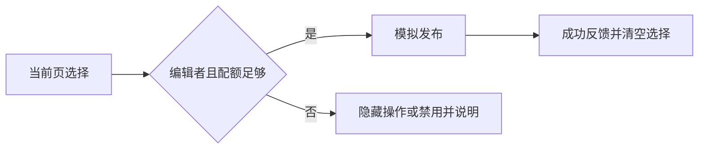

# 批量发布产品规则

隔离示例：编辑者发布当前页选中的草稿；所有提交、角色和配额均为本地模拟，未实现服务端权限与真实发布。

## 流程与原型

筛选与选择 → 核对当前页数量 → 模拟发布 → 清空已完成选择并反馈。原型 PT-batch-publish 的版本与当前源码一起保存。

[React 原型](../../../../../design/prototypes/batch-publish/demo.mdx) · [视觉规格](../../../visual/features/batch-publish/design.md)

## 具体规则

| 规则 | 条件 | 具体逻辑与反馈 | 验收 |
| --- | --- | --- | --- |
| RULE-batch-001 使用限制 | 当前页所选项 | 单次最多 3 项；超过上限禁用并解释，不能截断后静默提交 | AC-batch-001 |
| RULE-batch-002 功能透出 | 编辑者/查看者 | 编辑者看到发布操作；查看者看列表与选择摘要，隐藏发布操作；服务端授权未模拟 | AC-batch-002 |
| RULE-batch-003 配额 | 配额可用/耗尽 | 耗尽时保留入口但禁用，显示“本周期额度已耗尽”；保留选择 | AC-batch-003 |
| RULE-batch-004 提交逻辑 | 1—3 项、编辑者且配额可用 | 等待时阻止重复提交；模拟成功后清空选择并反馈实际数量 | AC-batch-004 |

## 相关异常与恢复

超过上限和配额耗尽保留输入；这里没有模拟真实失败或未知结果，不登记其恢复已验收。后续真实项目需要基于 API 契约补齐。

## 验收场景

- AC-batch-001：选择 4 项，发布禁用且上限原因可见；改为 3 项后恢复。
- AC-batch-002：切换查看者，发布入口隐藏，数量摘要保留。
- AC-batch-003：耗尽配额，按钮禁用且说明可见，选择不丢失。
- AC-batch-004：选择 2 项后操作，等待期间不能重复，成功反馈 2 项并清空。

以上作为原型可观察场景，执行结果进入独立检查记录。产品规则与生产实现状态分开。
