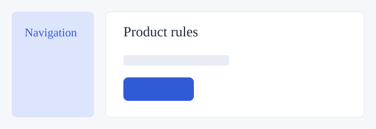

# 多格式预览样本

这些是自动生成的最小隔离样本，用于验证渲染路径与格式边界。

- [Word](rules.docx)
- [工作表](rules.xlsx)
- [CSV](rules.csv)
- [PDF](rules.pdf)
- [图片](layout.svg)
- [JSON](rules.json)
- [YAML](rules.yaml)
- [源码](logic.ts)
- [独立 Mermaid](states.mmd)
- [未知格式回退](source.custom)
- [HTML 与相对资源](../../../design/prototypes/formats/index.html)

