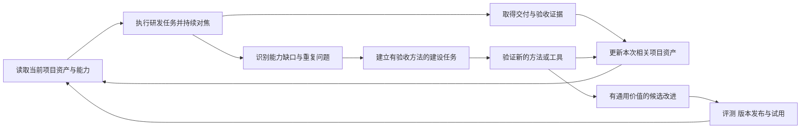

# 研发职责具体能力与项目持续沉淀方案

日期：2026-10-07。状态：规划草案。对应[多角色研发流程与 Harness 建设方案](2026-10-07-development-harness-plan.md)。

共同协议和当前逐个建设顺序见[总纲](constitution.md)，原生角色配置方式见[Codex 配置说明](codex-agent-setup.md)。本文提供能力建设契约和项目沉淀方式，各职责按实际验证逐步落实。

这套体系同时建设专业能力和项目能力。六个职责分别维护可执行、可验收、可演进的能力；每个项目持续维护自己的产品规则、设计系统、架构与工程约定、测试资产和运行方式。每次研发任务读取相关资产，完成工作后更新发生变化的部分，下次任务通过复用和实际核验受益。

通用 Skills 保存方法与适用条件，项目资产保存该项目有效的事实和决策，运行记录保存某次执行及其证据。经过验证的项目经验可以进入通用能力的候选改进，经过评测后再发布。首版仍优先 UI 与交互、研发测试持续对焦、可运行端到端交付。

下列能力是建设目标和验收契约，不表示已经实现。能力完整定义与成熟度逐步提升可以同时推进，不要求先把所有能力建设完成才处理实际任务。

## 能力的统一定义

每项能力至少具有以下信息。能力属于一个主责角色，可以引用其他角色能力作为依赖；跨角色成果通过同一验收条件关联。

| 内容 | 具体要求 |
| --- | --- |
| 编号与目标 | 能力编号、名称、要解决的问题和预期结果 |
| 主责和协作 | 谁负责产物，谁提供输入，谁验证结果 |
| 适用范围 | 任务类型、工程对象、前置条件和不适用情况 |
| 输入与判断 | 需要哪些事实，实际要做哪些判断和操作 |
| 输出与交接 | 产物位置、版本、下游如何使用 |
| 验证方法 | 可观察的成功判据、实际验证方法和证据 |
| 项目沉淀 | 应复用或更新的项目资产，以及唯一权威来源 |
| 更新条件 | 什么变化会使方法、资产或证据失效 |
| 能力现状 | 当前成熟度、验证过的环境、限制和待建设项 |

能力建设包含知识、方法、工具和评测四部分。先明确专业判断和成功条件；重复且适合确定执行的操作再提炼为脚本或工具。增加参考文档、脚本或工具数量，本身不代表能力提高。

## 产品设计的具体能力

产品角色负责用户任务、交互语义和验收目标，并持续维护项目的产品事实与有效决策。

| 编号 | 具体能力 | 交付与项目沉淀 | 验证方式 |
| --- | --- | --- | --- |
| P01 | 识别用户、场景、问题和已有证据，区分事实与假设 | 用户场景、问题清单、证据和待验证假设 | 能说明谁在什么场景遇到什么问题；没有把模型假设记成用户事实 |
| P02 | 确定功能范围、优先级、非目标与取舍 | 有效需求、范围、优先级依据和变更记录 | 每项工作对应目标；新增范围能说明理由和代价 |
| P03 | 设计信息架构、导航、核心流程和任务分支 | 页面与对象关系、用户旅程、任务入口和退出方式 | 从入口走通核心任务及本次相关分支，不依赖口头补充 |
| P04 | 定义交互状态、操作反馈、数据保留和失败恢复 | 交互状态与转换、操作规则、异常恢复和实际文案 | 状态及转换可执行；断网、重试、取消等相关情境有明确预期 |
| P05 | 定义业务规则、数据语义和可观察的验收条件 | 领域词典、规则、不变量、验收编号与用例映射 | 验收能判断实际目标行为；同一字段和概念在界面与接口中含义一致 |
| P06 | 使用原型或实际应用验证可用性，识别任务阻力 | 原型、任务脚本、观察结果和修改依据 | 在明确场景下实际操作；区分代理检查与真实用户反馈 |
| P07 | 将运行反馈转成产品改进和有边界的验证实验 | 用户反馈、行为指标定义、问题与实验记录 | 指标对应目标；有样本与条件的观察，避免从单次反馈推断普遍结论 |
| P08 | 管理需求演进、决策替换、功能废弃与产品债务 | 当前产品基线、决策历史、产品改进待办和废弃安排 | 下次任务能识别当前要求和历史要求；废弃决定关联实际影响 |

首版重点建设 P03、P04、P05、P06，并保留最低必要的 P01、P02。项目持续维护主流程、业务语义和交互规则；新反馈驱动 P07、P08，不在无数据时制造产品指标和用户研究结论。

## 视觉设计的具体能力

视觉角色负责界面呈现及其实际效果，持续维护能够被工程实现复用的设计系统。

| 编号 | 具体能力 | 交付与项目沉淀 | 验证方式 |
| --- | --- | --- | --- |
| V01 | 识别项目的视觉方向、品牌约束和有效参考 | 视觉原则、参考索引、选择依据与项目偏好 | 设计依据与项目目标一致；参考的适用范围明确 |
| V02 | 将版式、排版、间距、色彩等转为可实现的规范 | 设计 Tokens、布局规则、文字和密度规范 | 实际界面与规范一致；Tokens 与代码有明确权威来源 |
| V03 | 设计可复用组件及相关状态和组合规则 | 组件目录、状态示例、变体、使用规则与代码映射 | 组件在相关加载、禁用、错误等状态下可识别且可操作 |
| V04 | 设计目标设备、窗口和内容变化下的布局行为 | 响应规则、尺寸与内容案例、平台差异 | 在声明的目标尺寸和内容范围中实际检查，避免只验收单张截图 |
| V05 | 设计操作反馈、过渡和动效，协调交互语义 | 反馈与动效规范、触发条件、等待和完成状态 | 反馈与实际操作一致；动效不妨碍完成任务和必要的替代使用方式 |
| V06 | 核验可读性、焦点、键盘操作和其他相关可访问性 | 项目检查清单、发现的问题和修正示例 | 在实际呈现和操作中验证；明确本次覆盖和未覆盖范围 |
| V07 | 验收实际界面，定位视觉和呈现状态的偏差 | 有版本的界面基线、检查记录和缺陷 | 在可比较条件下检查实际渲染；截图差异结合语义判断 |
| V08 | 演进设计系统并处理重复组件、漂移和废弃 | 当前组件与 Tokens 版本、迁移规则和设计债务 | 更新后相关页面重新核验；新任务能复用现行组件并识别旧变体 |

首版重点建设 V02、V03、V04、V07，以及核心任务相关的 V06。视觉沉淀必须关联实际代码与组件，图片或文字规范不能独自成为另一套与实现脱节的系统。

## 架构的具体能力

架构角色负责系统契约与技术演进，持续维护能够解释当前系统及变化影响的架构基线。

| 编号 | 具体能力 | 交付与项目沉淀 | 验证方式 |
| --- | --- | --- | --- |
| A01 | 从实际工程识别系统组成、调用和数据流 | 当前系统地图、入口、依赖、外部服务和来源位置 | 系统地图可定位到实际代码和配置；未知部分明确标识 |
| A02 | 划分模块职责、依赖方向、共享接口与写入边界 | 模块契约、责任边界和依赖关系 | 变更和并行任务遵守边界；实际依赖与声明一致 |
| A03 | 定义 API、事件、错误、兼容和必要幂等语义 | 接口与事件契约、错误定义和版本安排 | 消费与实现一致；失败、重复和版本变化按适用场景验证 |
| A04 | 定义数据模型、一致性、不变量和生命周期 | 数据模型、状态、约束、所有权和保留规则 | 实际读写、并发和适用异常满足不变量；迁移不依靠隐含假设 |
| A05 | 复用已定技术约定，维护项目技术与代码规范基线，将性能、可靠性、容量和成本目标转为取舍 | 项目技术/工具链与交付基线、实际配置与检查入口、质量目标和测量条件 | 规范、实际入口与构建链可对账；变化定向更新；质量结论限定在已测范围 |
| A06 | 识别信任边界、权限、敏感数据与依赖风险 | 权限与数据边界、风险和相应验证安排 | 正向和拒绝场景成立；技术设计没有扩大既有权限 |
| A07 | 设计分阶段迁移、兼容、恢复和替换方案 | 架构决策、迁移顺序、兼容期和恢复条件 | 演练或适当验证证明阶段可推进，失败时能处理实际数据和依赖 |
| A08 | 参与研发复盘，复核代码业务、架构合理性与实现偏差，维护技术债务和决策 | 当前架构/目录模块地图、现行决策、证据、偏差和具体改进待办 | 源码变化后地图和契约可对账；建议有影响/取舍/验证，历史决策有替换关系 |

首版重点建设 A01、A02、A03、A08，以及涉及实际数据的 A04，基于整洁架构细化域、模块、层和契约。架构知识以当前工程为依据；设计意图与实际实现分别记录。已建立[架构专业 Skill](../../dev-architecture/SKILL.md)，具体方法与验证范围见[职责状态](../../../docs/architecture-agent.md)，其他能力按实际风险使用和验证。

架构当前在 A05 中维护[React/Next.js/Astro 技术约定与基线](../../dev-architecture/references/technology-stack.md)，并以[代码规范](../../dev-architecture/references/code-standards.md)支撑 A02/A05 的格式、静态/类型和真实依赖约束；其他类型暂不建设通用技术 Guide。工具检查与真实项目采用分别登记。

## 研发的具体能力

研发角色负责可运行实现和修复，持续积累项目的代码地图、工程约定、诊断知识及可复用实现。

| 编号 | 具体能力 | 交付与项目沉淀 | 验证方式 |
| --- | --- | --- | --- |
| E01 | 理解代码、现有模式、变更影响和实际入口 | 代码与功能索引、工程约定、影响范围和验证入口 | 能定位实际实现与受影响模块；避免按过期文档直接修改 |
| E02 | 将目标切分为可运行、可验收的纵向工作单元 | 功能切片、依赖、接口和当前可运行入口 | 每个切片能说明可以运行和验证的行为，拆分不只按文件数量 |
| E03 | 实现界面、组件、交互状态和前端数据行为 | 实际组件与页面、状态处理、设计和需求映射 | 在实际应用中满足交互契约和呈现要求 |
| E04 | 实现业务逻辑、接口、数据和异常处理 | 可审查实现、契约与必要运行配置 | 实际行为满足业务不变量和接口语义，相关失败路径可验证 |
| E05 | 从复现和运行证据定位根因、修复并防止回归 | 缺陷修复、原因证据、回归用例与诊断方法 | 原问题实际复验通过；没有仅压制表象或放宽验收 |
| E06 | 实施重构、依赖升级和迁移中的兼容修改 | 行为保持变更、适配代码和阶段验证 | 当前功能与契约保持或按已确定方案改变，集成结果重新验证 |
| E07 | 维护适合项目的自动测试、检查和开发工具 | 测试与验证入口、调试工具、必要可重复脚本 | 检查能证明目标行为；修改后实际执行，避免只复述实现 |
| E08 | 完成集成、依赖锁定、样例与可运行产物 | 集成版本、实际构建物、样例数据与启动支持 | 干净工作副本或目标平台能使用真实产物，运维和验收可接手 |

首版重点建设 E01、E02、E03、E05、E07、E08，后端功能同时启用 E04。研发经验先关联实际问题和版本；通用脚本和代码封装只在有明确复用收益时提炼。

## 测试验收的具体能力

测试角色负责持续证明目标行为和交付结果，持续维护项目的场景、数据、自动化与缺陷回归资产。

| 编号 | 具体能力 | 交付与项目沉淀 | 验证方式 |
| --- | --- | --- | --- |
| T01 | 将用户目标、交互和契约转为可验证场景 | 验收编号、场景与需求映射、可测性缺口 | 通过条件能证明用户目标；关键场景在实际环境可执行 |
| T02 | 验证功能、边界、异常和业务不变量 | 功能用例、边界数据、异常案例与证据 | 场景有明确预期并在当前候选版本实际执行 |
| T03 | 操作界面验证导航、表单、反馈和状态转换 | 交互测试、目标设备案例、操作记录 | 实际操作符合规则；不能以截图替代交互验证 |
| T04 | 从交付入口验证真实端到端用户任务 | 取得成果、准备环境、启动或安装或访问、用户操作的验收脚本 | 在声明环境完成核心任务，核验必要持久化和异常恢复 |
| T05 | 根据变化选择回归范围并维护历史缺陷保护 | 风险与回归映射、稳定场景和历史问题案例 | 已修缺陷仍被有效检测；跳过的检查有影响分析依据 |
| T06 | 验证适用的性能、安全、可靠性、数据或 AI 效果 | 对应专业场景、基线、样本和结果 | 测量条件和结论一致；说明覆盖边界，不混用测试结论 |
| T07 | 复现、归类、对焦、复验和关闭问题 | 版本与环境明确的缺陷记录、修复和复验关系 | 问题可复现；修复后由验收执行原场景和受影响回归 |
| T08 | 演进自动化、测试数据和稳定性，处理不可靠检查 | 测试资产目录、样例与环境、自动化入口和不稳定项 | 新会话能重复使用；失败原因可诊断；隔离不稳定项不等于通过 |

首版重点建设 T01、T02、T03、T04、T05、T07。T08 从最常重复的核心任务和已修缺陷起步，保留实际有效用例，清理重复或失去意义的检查。

已建立[测试验收专业 Skill](../../dev-acceptance/SKILL.md)，分别指导前端/界面、真实 API/数据、前后端完整 E2E、可启动交付与研发反馈复验。TC 关联 RULE/AC/ARC 和实际自动化/证据，Mock 边界与重试/跳过明确登记，项目策略/用例/报告持续维护。首版状态与工具案例见[职责说明](../../../docs/acceptance-agent.md)；真实项目和原生派发需对应验证。

## 运维的具体能力

运维角色负责实际交付与运行，持续维护可重复启动、发布、观察、恢复和退役的项目资产。

| 编号 | 具体能力 | 交付与项目沉淀 | 验证方式 |
| --- | --- | --- | --- |
| O01 | 定义并维护环境、依赖、配置和快速启动入口 | 前置条件、环境样例、准备和启动方式、停止方式 | 在干净环境按说明执行，并给出实际可用入口 |
| O02 | 构建和核验可安装、可分发产物及版本 | 产物索引、版本、构建和安装方式、平台要求 | 操作实际产物；可定位它与候选代码的对应关系 |
| O03 | 发布到要求的环境并管理配置和发布状态 | 发布流程、环境索引、实际发布记录和访问安排 | 目标环境和版本正确；有实际结果，未知结果先对账 |
| O04 | 定义健康与核心运行信号，定位运行异常 | 日志与观测入口、指标、健康和业务检查、运行说明 | 能发现相关异常；进程存活与核心任务正常分别核验 |
| O05 | 处理故障影响、恢复服务并组织后续修复 | 故障处理记录、诊断步骤、恢复证据与复盘 | 服务恢复有证据，后续问题能转入研发与验收流程 |
| O06 | 验证回退、备份、数据恢复和迁移运行安排 | 恢复手册、演练记录、数据与兼容条件 | 验证实际恢复方式；应用回退与数据恢复的适用范围明确 |
| O07 | 维护运行依赖、资源和环境变化的处理 | 依赖与资源索引、运行约束、升级和容量待办 | 运行变化能关联实际影响；改进后重新检查健康与核心任务 |
| O08 | 处理退役、交接、下游与环境清理 | 退役与交接安排、依赖和数据清理记录 | 下游和数据安排已核验；运行资产能够交给后续维护者 |

首版重点建设 O01、O02、O04；需要部署时启用 O03，重要发布补足 O06。所有启动与运行知识关联真实命令和环境，不能仅保存未经执行的说明。

## 体系各部分的持续建设能力

六个职责之外，流程和运行体系也维护自己的能力、失败案例和改进待办。

| 部分 | 需要持续建设的具体能力 | 沉淀与验证 |
| --- | --- | --- |
| 流程入口与协调 | 目标与范围识别、任务路由、依赖和并发安排、分歧处理、交付与恢复协调 | 路由与失败案例、范围和阶段规则；比较误路由、返工及端到端结果 |
| 角色 Skill Set | 能力发现、按需加载、专业指导、工具配合、跨角色交接和能力演进 | 能力目录、操作参考、有效示例和反例、对应评测；验证实际行为 |
| 运行内核 | 状态与依赖、版本和缺陷、证据失效、外部结果对账、资产引用与恢复 | 契约与版本、故障场景、内核测试和迁移方式；核验状态一致性 |
| 项目适配 | 接入已有工程、识别权威来源、核验命令和环境、读取及更新项目资产、识别能力缺口 | 项目配置、资产索引、能力账本；从新会话证明能够定位并复用 |
| 宿主适配 | 工具发现、模型约束、授权与能力协商、结果归一、宿主变化处理 | 已验证的宿主版本、能力矩阵和兼容案例；接口变化后重新验证 |
| 评测体系 | 真实案例维护、回归选择、失败注入、交付质量和成本比较、评测失效识别 | 可重复案例与原始结果、有效判据；案例和目标变化时维护 |
| Plugin 分发 | 打包、依赖和引用核验、版本升级、兼容声明、安装检查和回退 | 版本记录、干净环境安装案例与回退演练；不以清单校验替代行为检查 |

每个部分都有维护者和可观察的成功判据。出现运行问题时能够定位是角色能力、项目配置、工具环境、流程契约或内核缺陷，避免把所有问题都变成一条新的全局提示词规则。

## 首版关键能力的执行契约

以下六项各选取一个职责的关键能力，说明能力如何从清单进入可执行工作。其他能力使用同一信息结构，按任务需要逐项完善操作参考，不要求每轮全部加载。

| 能力 | 必需输入 | 具体操作 | 产物和通过条件 | 沉淀与更新条件 |
| --- | --- | --- | --- | --- |
| P04 交互状态与恢复 | 用户任务、数据语义、已有操作规则和相关失败情境 | 识别触发动作和状态；明确加载、取消、失败、重试及内容保留；把转换写成可验收行为 | 交互状态与转换契约；研发和验收可按同一规则执行，关键未决行为有处理方式 | 更新项目交互基线与验收映射；用户任务或操作语义变化时重新设计 |
| V03 组件与状态 | 交互契约、现行 Tokens、实际组件、目标尺寸和内容 | 找可复用组件；设计必要变体与状态；核对文字、布局、焦点和反馈；关联实际代码 | 状态示例和组件规范；实现后的相关状态在实际界面中正确呈现 | 更新组件目录、状态和代码映射；Tokens、组件或内容范围变化时重新核验 |
| A03 接口与失败契约 | 交互语义、现有 API 或事件、数据约束和消费者 | 明确输入输出、错误和状态；处理适用的重复请求、超时及兼容；检查消费者影响 | 接口与错误契约；实现与消费行为一致，相关失败和重复场景有验证方式 | 更新实际接口契约和依赖索引；接口或消费者变化时核验受影响能力 |
| E05 诊断与修复 | 版本和环境明确的缺陷、复现步骤、原始证据和有效契约 | 复现并定位原因；在范围内修复；运行针对检查；提交原因、变更和待复验版本 | 可审查修复及证据；测试能针对该版本复验原问题，不能以自报成功关闭缺陷 | 更新必要代码索引、诊断经验和回归；后续类似故障先核对适用条件 |
| T07 持续对焦与复验 | 验收条件、当前候选版本、可用环境、缺陷和修复说明 | 实际操作；记录预期与实际；向研发定向反馈；修复后运行原场景和受影响回归 | 有复现与修复关系的缺陷及实际复验记录；有效证据对应当前版本，阻断问题已解决 | 更新缺陷回归、测试数据和覆盖索引；行为或环境变化时维护场景 |
| O01 干净环境启动 | 实际工程、依赖、配置要求、外部服务、交付模式和核心任务 | 在新工作副本准备规定环境；执行真实入口；确认可用地址或应用；与验收完成核心任务；核验停止方式 | 启动入口、前置条件和证据；按照说明在声明环境可启动并完成约定操作 | 更新运行配置、启动手册与测试入口；依赖、环境或入口变化时重新验证 |

六项契约共用需求、候选成果与资产版本。角色交接时移交对应产物和原始事实，后续角色读取自己需要的内容；不能让每个角色按独立猜测重新定义同一功能。

## 每个项目持续维护的资产

项目资产直接支持下一次工作，来源以现有工程和有效决策为准。已有文档、组件、测试和脚本优先作为权威来源，通过索引引用，避免复制出第二份相互冲突的版本。

| 项目资产 | 主责 | 内容与更新触发 |
| --- | --- | --- |
| 项目现状和工作入口 | 协调者，六角色补充 | 项目目标、当前交付方式、源文件与运行入口；接入和实际结构变化时更新 |
| 产品与交互基线 | 产品 | 核心流程、业务规则、验收目标、已确认决定和当前反馈；需求和行为变化时更新 |
| 设计系统与界面基线 | 视觉 | Tokens、组件、状态、目标设备、当前实际界面；组件与界面变化时更新 |
| 系统与技术契约 | 架构 | 模块、接口、数据不变量、依赖与架构决策；契约和结构变化时更新 |
| 工程地图和可复用工具 | 研发 | 功能代码位置、约定、构建调试入口、经过验证的方法；工程和工具变化时更新 |
| 场景与回归资产 | 测试验收 | 验收场景、数据、历史缺陷、自动化入口及覆盖缺口；新增行为和问题修复时更新 |
| 交付与运行资产 | 运维 | 环境、启动安装发布方式、观测、恢复和故障手册；交付和运行条件变化时更新 |
| 能力账本与改进待办 | 协调者汇总，各部分主责维护 | 本项目各能力的有效状态、证据、缺口、建设任务和改进效果 |

项目采用统一的六角色索引，但不要求一次创建全部目录或把每份产物放进新目录。没有界面的项目可以标明相关视觉能力不适用；某能力缺少验证时标为待建设或证据不足。

### 持久资产与临时运行数据

建议在项目现有文档约定下维护以下入口；没有约定时可使用此布局：

```text
项目仓库/
├── docs/dev-flow/
│   ├── overview.md                 # 当前项目入口和有效事实索引
│   ├── project.json                # 实际工程与交付配置
│   ├── asset-index.json            # 指向现有文档、代码、用例和运行资料
│   ├── capability-ledger.json      # 项目能力现状、证据和缺口
│   ├── improvement-backlog.md      # 有问题依据和验收方式的建设待办
│   └── learning/                   # 有复用价值的已验证经验，按需创建
├── 原有产品 架构和运行文档          # 优先继续在原位置维护
├── 原有组件 设计 Tokens 测试和脚本  # 实际可执行资产的权威位置
└── .dev-flow/                      # 忽略的本地数据库、缓存和本轮日志
```

长期资产和必要索引进入版本管理；本地数据库保存运行状态并可建立查询缓存，不能覆盖项目文件的权威事实。经验需要保留可复现方法、来源版本和必要证据，不能仅指向会随缓存清理而消失的本地日志。

外部设计文件和运行资料可以作为权威来源索引，保存访问位置、版本及必要的范围。无法访问时保留限制，不凭旧摘要覆盖当前真实来源。凭据使用项目既有的保管方式，项目资产只记录必要配置与取得方式。

### 资产记录与变更关系

每条可复用资产记录编号、类型、主责、权威位置、来源版本、适用范围、关联需求与能力、验证证据、有效性和替换关系。来源改变时识别受影响资产；当前有效、待核验、候选与已废弃的内容分别记录。

维护需求、交互与组件、代码与契约、测试与缺陷、交付与运行之间的依赖。例如组件状态改变需要重新核验相关界面与交互用例；接口改变可能影响页面、测试数据和运行说明。只更新受影响资产，无法确定影响时先核查。

没有变更且仍有效的资产直接引用，不为每次任务复制一份。新任务读取相关索引与必要资产，不把全部项目历史塞入每个角色上下文。

## 持续沉淀的工作循环



### 任务开始

读取项目目标和有效配置，按角色和任务检索相关资产。核对来源版本、环境与当前事实是否一致，记录本次使用的资产版本。可以继续使用的资产直接复用；需要更新的相关资产作为任务内容；无关缺口进入建设待办。

### 每轮研发测试

新增场景与缺陷关联验收条件和候选版本，研发修复后由测试复验。设计、契约、数据或运行条件变化时更新对应专业资产或候选变更，保持本轮所有角色面对相同有效输入。尚未证实的原因和方法作为候选，不能直接成为现行规范。

### 交付与沉淀

每个启用角色报告资产变化：复用哪些资产、更新哪些事实或产物、形成哪些可复用经验、发现哪些能力缺口。没有新的有价值内容时允许报告仅复用或无需更新，不强制生成复盘文件。

完成必要的相关资产更新后记录本次实际交付、输入和成果版本、验收证据及后续事项。未完成沉淀时分别报告“成果已验收，相关资产待更新”，不能把产品功能重新标为失败，也不能宣称本次完整交付及沉淀工作均已结束。

只围绕本轮授权范围更新项目资产。与当前交付无关的组件推广、平台升级、通用技能改写或长期研究进入建设待办，避免沉淀扩大研发任务。持续建设通过后续已授权任务和复盘触发；定时执行属于单独的调度能力，不在规划阶段自行创建。

### 后续任务验证复用

后续任务需要实际使用上一轮产物，例如复用组件、运行回归用例、按已验证入口启动、根据当前接口或决策继续开发。记录复用是否减少重复调查、是否仍满足结果，而不是只统计新增文档数。

## 能力成熟度与有效性

能力成熟度与当前项目有效性分别管理。曾经验证过的能力可能因项目或环境变化需要重新核验，不能因为等级较高就永久信任。

| 成熟度 | 含义 | 必需依据 |
| --- | --- | --- |
| M0 已定义 | 存在清晰能力契约，尚未证明实际执行 | 输入、判断、产物、验收方式与适用边界 |
| M1 项目已验证 | 在明确项目与环境中执行成功 | 可定位的成果、实际证据和可复现方法 |
| M2 可复用 | 已证明在声明范围内可重复使用，边界已验证 | 代表场景、适用与不适用条件、有效复用和回归案例 |
| M3 持续维护 | 有稳定的回归、变更核验和版本演进机制 | 回归结果、失效处理、维护责任和升级或回退记录 |

M3 不要求全部专业判断自动化。产品可用性和视觉质量等仍需要适当的实际检查，自动化负责可重复部分和漂移信号。

项目能力账本按能力编号记录成熟度、当前有效性、使用的通用能力版本、项目资产、最近实际证据、限制和建设待办。未观察过的能力记未知；不适用与尚未具备分别记录，不把没有证据写成已经验证。

体系可以汇总“能力 × 项目”的覆盖矩阵，每格显示当前成熟度、有效性和证据入口。它用于识别哪些项目能复用什么、下一项能力在哪里验证，不用一个平均分掩盖关键交付能力缺失。

来源、工具、环境、验收规则或适用范围变化触发相关能力重新核验。不能只刷新“最后检查日期”来保持有效状态。项目长期未运行时根据其实际风险提示核验，不设所有资产统一的机械有效期。

## 从项目经验提升通用能力

通用能力迭代采用：**观察问题 → 项目内验证 → 提出候选方法 → 验证适用范围与边界 → 更新 Skill 或工具 → 行为评测 → 版本发布 → 项目试用**。

只有项目内成立的经验先保留在该项目；通用候选需要说明可以帮助哪些任务，避免把特定组件风格、一次故障的偶然条件或用户偏好升级为全局要求。

每项通用改进有来源问题、主责、预期收益、操作变化、验收案例和采用范围。评测包含代表性成功场景及有意义的边界或不适用场景；复核读取原始任务与产物，不预填期望判断。

常规资产维护在既有任务授权内推进。涉及更改用户确认的产品取舍、扩大外部动作范围或环境要求批准时请求具体决策。项目采用新通用版本前检查与现行需求、实现和工具的兼容性；试用失败时回退方法版本，保留实际有效的项目成果。

建设待办按交付影响、出现频率、风险和投入排序。每项待办明确问题证据、能力编号、目标、产物、验收方式、主责和依赖。重复问题优先提炼为回归、组件或工具；一次问题先修正最窄的实际原因，不积累无依据的通用限制。

## 示例 从一次保存失败修复到持续复用

以下为行为设计示例，不代表已在任何项目运行。

任务要求一个编辑界面在保存失败后保留内容并允许重试：P04 定义状态与恢复语义，V03 定义组件呈现，A03 明确接口结果和适用的重复请求行为，E03 实现，T03 与 T07 操作复现、反馈和复验，O01 保证实际启动入口可用。

研发测试发现重试后界面仍处于加载状态。验收记录候选版本、步骤、预期、实际和操作证据；研发基于证据定位并修复；测试复验原场景和受影响路径。

本次项目沉淀包括当前交互状态、实际组件、接口规则、失败与重试回归、根因与诊断方法，以及已验证的启动配置。它们保留在各自权威位置，由项目索引关联到对应能力。

下一次任务增加自动保存时，入口检索这些资产，产品核对新行为与旧语义，研发复用有效组件和接口约定，测试执行旧的失败重试场景并补充新行为，运维复核实际启动配置。已有证据只在版本与依赖仍有效时复用。

若该方法在其他适用场景验证有效，再将“异步保存失败恢复的交互与验收方法”作为通用候选，提炼到产品、研发和验收的相关能力参考中，并提供边界案例。单个项目的具体文案、布局和业务规则保留在项目中。

## 接入实现计划的检查点

| 原阶段 | 增加的建设与沉淀成果 | 退出条件 |
| --- | --- | --- |
| 阶段零 | 代表项目的相关资产和能力现状，三个任务的交付入口 | 能定位已有权威来源；缺失、过期与未知分别记录 |
| 阶段一 | 六职责共四十八项能力契约，关键能力参考、项目资产与能力记录契约 | 首版关键能力能执行与验收；其余能力有明确建设边界，不冒充已具备 |
| 阶段二 | 真实 UI 任务的角色产物、资产变化和后续复用验证 | 新任务或新上下文能复用已更新资产，实际启动与核心操作仍成立 |
| 阶段三 | 资产检索与引用、变更核验、角色沉淀、项目能力查询和恢复 | 来源变化使相关资产待核验；沉淀没有丢进临时缓存；并发更新能对账 |
| 阶段四 | Plugin 版本对应能力版本；项目试用、兼容与回退 | 项目能判断采用了什么版本；升级后真实行为和资产仍正确 |
| 阶段五 | 各角色与体系部分的建设待办和已验证通用改进 | 每次增强有实际问题、结果和适用范围；过期方法能够替换或退出 |

初期可以通过文件索引和标准交接完成沉淀，在实际重复操作出现后再增加专用工具。数据结构为具体行为服务，不提前建立复杂知识平台。

## 持续建设的验收场景与指标

关键场景包括：新会话能够定位上一轮有效资产；相关代码变化后旧资产被标为待核验；已修缺陷在后续变更中被回归捕获；启动说明在干净环境仍有效；两个项目的不同规则不会混淆；通用候选不会自动覆盖现行项目决策；并发角色更新同一资产时能够协调；清理本地运行缓存后持久资产仍能使用；新 Skill 版本试用失败后能够回退。

复用验收使用新的上下文或工作副本，只提供本次请求、项目与必要访问入口，不提供上一轮对话摘要作为答案。执行者需要从持久资产定位当前事实、核验适用条件并完成任务，才能证明项目沉淀独立于聊天历史和本地缓存。

指标关注有效复用带来的结果：重复调查时间、问题重开与重复缺陷、资产失效发现、定位当前入口的成本、干净环境启动与端到端通过，以及能力改进前后的实际行为。新增文档、能力条目和工具数量仅用于盘点，不能单独作为建设成果。

正式判断持续沉淀有效，需要连续任务之间的实际传承证据：后一任务使用了前一任务维护的资产，核验它在当前环境有效，并完成了本次目标。
