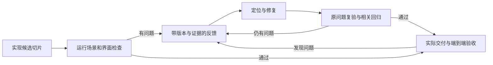

# 多角色研发体系总纲

版本：0.4。更新日期：2026-10-08。本次调整：共享组件默认复制或参考源码进入项目，支持直接迭代与通用改进回收；模型选择仍归属任务调用方与宿主策略。

本总纲在独立 `dev-flow` 仓库维护，作为 `dev-flow` Skill 的参考通过全局符号链接读取。各职责的专业配置按建设顺序增加，项目资产仍保存在所属项目中。

本总纲规定多角色研发体系的共同目标、协作与交接、持续测试、交付和项目沉淀。后续按此逐个建设 Codex 职责 Agent、专业 Skills 和必要工具。当前建设顺序为先形成总纲，再逐个配置和验证职责，随后用真实任务检验完整协作。

总纲是本体系共同协议的维护入口；[总体建设方案](2026-10-07-development-harness-plan.md)保留完整路线与待实现的内核设计；[职责能力与项目沉淀方案](2026-10-07-role-capabilities-and-project-assets.md)提供六职责四十八项能力；[Codex 配置说明](codex-agent-setup.md)说明如何逐个落实原生角色。用户当前指令和宿主约束始终优先。

## 共同目标

任务以用户要求的实际结果为终点。研发交付优先保证严肃的 UI 与交互设计、研发测试持续对焦，以及能够使用、快速启动或已要求部署的成果。设计和计划服务于交付，专业指导逐步增强。

每项任务明确交付范围。要求规划、评审或文档时验证对应成果；要求可运行功能时实际启动并完成核心任务；要求上线时验证实际部署和约定运行结果。以范围内必需验收条件是否成立判断完成。

体系覆盖需求、设计、实现、测试、交付、运行、维护和退役。按任务种类、工程对象、风险与当前阶段选择工作路径，每次只启用有实际作用的职责。

## 总纲和执行组件的关系

| 组件 | 职责 |
| --- | --- |
| 总纲 | 维护共同协议、验收和项目沉淀原则 |
| 主 Agent | 理解目标、确定范围、选择能力和职责、处理依赖与冲突、综合证据并推进交付 |
| 职责 Agent 设置 | 定义专业身份、职责边界、工作和交接要求；模型选择由宿主策略处理 |
| 专业 Skills 与参考 | 承载按需读取的操作方法、案例、专业工具和评测 |
| 项目长期资产 | 保存当前有效的产品、设计、架构、工程、测试与运行知识 |
| 运行记录与后续内核 | 保存任务、候选版本、问题、证据和恢复状态；确定性工具按实测需要建设 |

Agent 配置承载角色行为，项目知识保存在项目中。新会话通过项目入口找到有效资产，不依赖上一轮聊天历史。配置文件本身不能证明某项专业能力已通过实际验证。

核心协议保持工具无关，保留跨工具复用能力；Codex 的原生 Agent 配置、会话设置和工具接入由适配层处理，优先在 Codex 上验证。其他宿主的适配按实际需要建设，共同的任务、交接、证据和资产协议独立维护。

## 六个职责

| 职责 | 主责与必要交接 |
| --- | --- |
| 产品与交互 | 定义用户任务、信息架构、交互状态、业务规则和验收条件，交给视觉、架构、研发和验收 |
| 视觉设计 | 定义布局、组件、Tokens 与状态呈现，关联实际实现，并检查最终渲染 |
| 架构 | 定义系统边界、接口、数据和兼容契约，处理重要技术取舍与演进 |
| 研发 | 形成可运行切片，集成实现，依据缺陷证据定位和修复，提交待验成果 |
| 测试验收 | 早期定义场景，实际验证候选成果，反馈问题，复验并作出有证据的验收结论 |
| 运维与交付 | 维护启动、安装、发布、运行与恢复方式，验证实际交付入口 |

每个职责同时维护自己的方法、项目资产、能力现状与建设待办。相关核心能力先在项目中证明有效，再逐步增强。关键架构和运行问题在发现时处理，职责配置的建设顺序不限制实际工作的需要。

## 任务入口

主 Agent 从当前请求、项目事实和已有有效决定形成最小简报，包含目标与交付范围、相关验收条件、工程对象、风险、当前阶段、有效资产、未知问题及下一步。已有清楚简报时引用并更新发生变化的部分。

| 工作路径 | 使用条件 | 必需结果 |
| --- | --- | --- |
| 快速路径 | 目标清楚、局部可逆、有对应验证方式 | 实现或修复、针对验证、约定交付及必要资产更新 |
| 标准路径 | 涉及完整用户行为或多个模块 | 必要设计、可运行切片、持续验收、实际交付及项目沉淀 |
| 系统变更路径 | 涉及重要接口、数据、权限或运行兼容 | 增加相应契约、迁移与恢复验证 |
| 故障路径 | 服务正在产生实质影响 | 在授权范围内恢复、验证恢复、定位原因并完成后续修复 |
| 探索路径 | 当前目标是消除不确定性 | 明确问题、实验、观察和后续选择 |

重要未知问题通过具体问题澄清，其他独立工作继续。已有授权范围内的实施、必要修复与复核持续推进；只有影响核心决定、超出授权或宿主要求批准的事项请求用户决策。

## 派发和协作协议

派发给职责 Agent 的任务包含：任务编号、当前目标与范围、主责能力、有效输入和资产版本、依赖、可写范围、成果位置、验收条件、交接方式与停止条件。模型和推理强度属于执行策略，遵循用户最新要求和宿主可用配置。职责源码默认省略模型与强度，沿用宿主派发默认或父会话设置；用户为某次任务指定选择时，由调用方在该次派发中提供。验证记录保留实际执行设置，不将一次评测的选择固化为通用要求。

职责需要实际可用且能够独立交付时才派发。职责尚未建设或宿主不能选择该 Agent 时，由主 Agent 明确承担对应职责，不声称已启用专门 Agent 或完成独立复核。

同一文件或共享接口由一个写入者负责。依赖任务顺序执行；独立任务在可控写入范围内并行。共享原始事实和有效契约，最终集成成果重新验收。当前会话的实际并发限制优先于配置中的理论上限。

角色分歧依据用户目标、有效决定、契约和证据处理。变更需求或契约时通知受影响角色，更新有效版本和相关检查；不能只修改验收来使当前实现通过。

## UI 与交互最低协议

含界面任务明确核心操作、页面与导航、目标设备、本次相关交互状态、业务文案和异常恢复。产品负责交互语义，视觉负责呈现，研发实现，测试实际操作，视觉检查实际渲染。

按[UI 技术栈与共享组件约定](ui-stack-and-components.md)执行：新建 Web 原型默认 Vite + React；B 端采用 Ant Design 规范并优先使用 antd 组件；C 端 Web 优先使用 shadcn/ui；其他 C 端应用实施前先开展网上参考研究。React 组件源码与 Skill 在 Git 中持续维护，通用组合经过验证后进入共享库；项目默认复制或参考源码、本地维护，记录来源提交或哈希、项目差异和实际验证。

新的核心流程按复杂度提供可操作原型或完整状态示例；已有局部修改记录本次变化和受影响状态即可。相关加载、空、成功、失败、禁用、权限、取消、重试和数据保留状态有具体预期。

视觉验收与交互验收分别记录。实际截图用于核验呈现，实际操作用于核验行为；目标设备和必要可访问性检查按项目适用范围执行。失败恢复和真实用户操作进入研发测试循环。

## 研发测试持续对焦

测试从需求和设计阶段参与，研发尽早提供可以实际运行的纵向功能切片。每轮执行以下循环：

问题包含编号、关联验收条件、候选版本与环境、复现步骤、预期与实际、影响、证据、负责人和状态。研发修复后提交待复验版本；验收角色实际复验后关闭问题。重复失败时回到复现、根因、契约和环境核查。

研发和测试可以持续沟通，测试保留自己的实际核验。重要最终验收使用新的评审上下文。测试策略匹配行为与风险，代码、UI、配置、迁移和性能采用能够证明对应结论的方法。

## 交付和完成条件

交付模式在入口确定为可启动源码、可安装产物、预览部署、生产部署或本次明确的其他成果。没有指定部署目标的研发试点优先保证可启动交付。

可运行交付提供成果位置或访问入口、实际版本、前置条件、必要环境样例和数据、真实启动或安装方式、已经验证的核心任务与剩余问题。验收在干净工作副本或目标环境完成核心用户操作和相关异常检查。

成果已实现、已提交、已验收、可运行交付与已部署分别记录。只有当前版本对应的必需检查通过、阻断问题关闭、约定交付成立，并完成必要相关资产更新，才能结束本轮完整工作。

没有执行的检查、未知外部结果、过期证据和豁免分别记录。缺少工具或环境时说明对应验收缺口，继续其他可完成工作。结果未知的发布或迁移先查询实际状态，再决定后续动作。

## 项目沉淀协议

任务开始读取并核验当前有效资产；过程中维护相关变化；交付时形成资产变化和能力缺口；下一任务实际复用并核验。优先更新已有权威位置，项目索引关联产品与交互、设计系统、架构与工程、回归和交付运行资产。

长期资产和必要索引按项目文档规范进入版本管理；没有现行规范时使用 `docs/dev-flow/`。本地 `.dev-flow/` 保存临时运行状态与缓存。可复用经验保留可追溯来源和可重复方法，不能只依赖缓存中的日志。

能力成熟度与当前有效性分别管理。能力可以已定义、项目已验证、可复用、持续维护；源代码、契约、工具或环境变化时定向重新核验。每个项目维护能力账本和有依据的改进待办。

每个启用角色报告复用资产、更新资产、有效经验和能力缺口；无变化时记录复用或无需更新。与本轮无关的通用建设进入待办。通用候选经过适用边界和行为评测后再形成 Skill 或工具版本，不自动覆盖项目决定。

## 统一交接结果

角色结果使用以下结构；小任务允许简短表达，但关键信息可核验：

1. 当前结论和实际完成范围。
2. 成果位置、候选版本和有效输入。
3. 验收条件覆盖、实际证据和未执行项。
4. 问题状态、限制、依赖与下一步。
5. 项目资产复用和更新、能力缺口与候选经验。

主 Agent 综合原始成果和证据，再形成用户可直接使用的交付说明。子 Agent 自报成功作为待核验结果。

## 职责 Agent 的逐个建设规范

每次建设一个职责，交付职责配置、相应核心能力指导、项目资产读写协议，以及代表行为案例和验证记录。先形成清晰专业边界，按实际需要增加工具；公共协议引用本总纲并在配置中保留执行所需的最小要求。

一个职责完成的检查点为：配置能被目标 Codex 发现；模型与推理强度符合用户约束；代表任务产生合格成果；职责边界和关键失败行为成立；能够读取及维护相关项目资产。区分静态配置校验、发现加载和实际模型行为验证。

Agent 配置来源、能力指导、项目资产和采用版本都可定位。配置在新会话中核验，升级时检查既有项目兼容性；保留可恢复的上一有效版本。

## 当前建设顺序

| 次序 | 建设对象 | 首次验证重点 |
| --- | --- | --- |
| 1 | 总纲 | 共同协议、交接、交付和沉淀条件一致，后续职责可引用 |
| 2 | 产品与交互 Agent | 从实际需求形成用户流程、交互状态和可验收行为 |
| 3 | 视觉设计 Agent | 将交互契约落实为可实现组件和状态，并核验实际界面 |
| 4 | 测试验收 Agent | 场景、复现、持续对焦、复验与端到端交付检查 |
| 5 | 研发 Agent | 按切片实现，处理测试反馈，提交当前候选版本和工程资产 |
| 6 | 运维与交付 Agent | 干净环境启动、实际产物或部署、核心任务和恢复 |
| 7 | 架构 Agent | 系统与接口、数据契约、变化影响及演进；重要需求出现时可提前建设 |

逐个职责验证后，用一个真实 UI 功能跑通完整协作，再依据重复操作和实际失败建设运行内核、Plugin 分发与其他专业路径。总纲和各部分持续演进，保持用户已确定的优先级。
