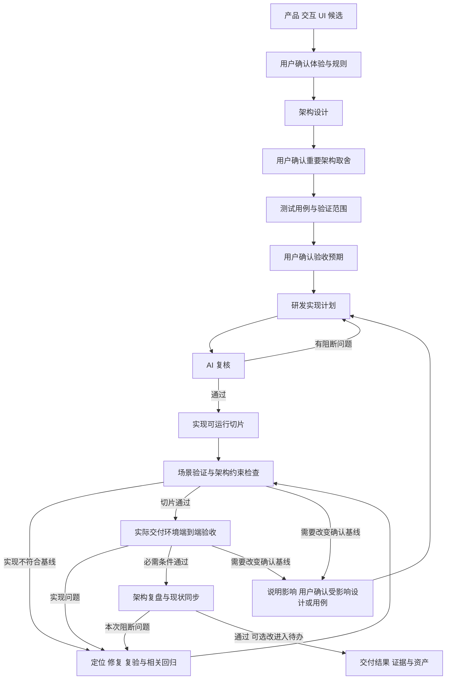

# 设计确认、计划复核与自主实现

日期：2026-10-08。共同执行协议，依据用户本次流程偏好维护。当前已定义指导，尚未通过真实功能验证整套执行。按任务范围使用：完整功能采用下面的确认与实现流程；已有有效基线的修复和局部变更复用既有确认，不重新走全套审批。用户与宿主当前指令优先。

含界面功能确认相关产品/交互/UI 成果；后端、CLI、配置或其他工程按实际对象选择适用的设计与用例，无关阶段注明不适用，不额外制造 UI 或设计审批。

## 用户确认的范围

| 成果 | 用户确认什么 | 需要保留的基线 |
| --- | --- | --- |
| 产品、交互与 UI | 用户任务、业务规则、核心流程、状态和恢复、目标设备及相关视觉方向 | 产品/视觉规格、原型及有效 RULE/AC、版本和确认范围 |
| 架构设计 | 系统与模块边界、数据与接口、权限、运行/交付方式、重要技术选择及成本/兼容约束 | 可实现的架构设计、契约与重要决定；不要求用户核对每个内部文件和代码细节 |
| 测试用例 | 用户可以观察的正常、边界、拒绝、异常与恢复结果，核心链路和必要回归；架构约束的验证方式 | 稳定用例 ID、对应 RULE/架构约束、前置数据、操作、预期、验证环境及实际覆盖边界 |

确认可以分步进行，也可合并展示架构与测试用例后一次确认。完整候选先具备可审阅的当前项目文档、原型/示例和真实预览再请求确认，明确项目归属、对应产品/设计UI/技术/用例入口、待决问题和变化影响；按[项目文档协议](design-document-contract.md)定位实际成果，通用 Skill 参考不作为项目确认基线。已有明确用户决定只记录并复用；候选、Agent 自查、用户查看页面或未答复都不能登记为已确认。

确认记录保存成果位置、有效版本/提交或哈希、范围、用户确认来源及尚未确定的事项。关键设计变化只重新确认受影响部分。早期架构可行性和测试可验证性检查可以反向调整设计，必要时准备小型实验；受影响的正式实现以有效确认基线为依据。

## 实现计划与一次 AI 复核

研发仍产出可执行实现计划，关联用户已经确认的产品/视觉、架构和测试用例版本。计划至少说明本次范围、可运行切片与依赖、主要变更位置、接口/数据变化、各切片验证和交付启动方式；相关迁移、兼容和恢复按任务补充。小任务可直接在任务记录中表达。

计划由 AI 在实施前明确复核一次，不增加人工实现计划审批。复核依据原始有效规格和实际工程，检查：

- 计划覆盖相关规则、架构约束、测试用例与约定交付；任务依赖和写入范围能够成立。
- 工程入口、技术选择与实际依赖可用；重要未知项有对应验证，不凭假设保证可行。
- 关键结果有真实检查方式，相关数据、权限、失败/恢复和兼容约束有落实位置。
- 计划未暗改用户确认的行为、重要架构取舍或验收预期；必要变化回到对应设计确认。

可用且获准委派时，优先由独立 AI 评审上下文复核，具体执行者与模型遵循用户和宿主设置。不能委派时，由主 Agent 单独执行并记录 AI 自查，不能声称独立复核；用户明确要求独立评审时依该要求执行。架构/测试等职责尚未建成时明确实际承担者。

记录计划版本、所依据的基线、实际复核方式、结论和问题。阻断问题由 AI 修正并定向复核，通过后直接开始已授权范围的实现。不能把评审人的名称或配置存在当作已执行复核。实施中普通步骤调整和缺陷修复更新计划；新证据使计划的重要假设失效时，AI 定向重审受影响部分。

## 自主实现、调整与端到端验收

此图表达完整功能的依赖，实际确认可合并，已完成阶段直接复用。研发与测试从可运行切片开始来回对焦；等待用户确认时继续不依赖该决定的调查、候选准备与其他授权工作。

Agent 可以自主调整内部实现、任务切分、诊断与修复方法，补充真实测试数据和脚本，修正选择器/测试环境等执行问题；保留已经确认的业务、架构与验收含义。改变架构内部实现但不改变确认约束时，记录符合性和必要回归即可。不能通过删除场景、降低预期、扩大容差或把真实链路替换为模拟来关闭缺陷。

测试用例中的可观察预期由确认基线约束，自动化实现由 Agent 维护。发现用例错误或歧义时对照原始规格报告依据；调整已经确认的验收含义须请求具体确认。测试失败先核查实现、测试执行和环境，按实际根因修复；重复失败回到诊断，不机械重跑或擅自降低要求。

最终在当前候选的真实启动/安装/部署环境执行约定端到端链路，检查实际操作、相关持久化、异常与恢复、视觉/交互以及可启动交付。端到端结果作为交付主线，架构约束同时通过相应契约、集成、数据、权限或性能检查证明；用例策略按项目风险定义，不强制所有验证都塞进浏览器测试。

架构按[专业方法](../../dev-architecture/SKILL.md)检查相关实现与必需契约，并在实质研发结束后基于当前源码和实际验收结果完成定向复盘：更新系统与目录模块地图、业务域/层次和模块分工，评价合理性、登记有证据的建议。可与交付核验合并；局部任务裁剪范围，不新增人工计划确认。复盘发现本次必需条件不成立时继续修复/复验，可选演进进入待办。

只有当前必需条件通过、阻断问题关闭、实际交付成立，才能给出完成结论。用户不需要逐步复核代码或实现计划，最终获得可用成果与证据，可继续提出体验反馈。基线确认不会自动扩大外部动作权限；环境缺失先自主排障，无法取得必要资源时报告对应缺口，不能登记为验收通过。

## 项目沉淀与新上下文

优先使用已有权威位置；没有规范时按需采用：

| 资产 | 默认位置 |
| --- | --- |
| 产品/视觉规格、原型和检查 | [共同设计文档协议](design-document-contract.md)的目录 |
| 当前架构入口与本次设计 | `docs/dev-flow/architecture/index.md`、`docs/dev-flow/architecture/changes/<任务ID>/design.md` |
| 实际模块地图与架构复盘 | `docs/dev-flow/architecture/modules.md`、`docs/dev-flow/architecture/reviews/<日期>/<任务ID>.md`；详见[架构资产协议](../../dev-architecture/references/project-assets.md) |
| 可读用例与验证范围 | `docs/dev-flow/acceptance/features/<功能ID>/cases.md`；自动化在项目实际测试目录维护 |
| 实现计划与 AI 复核 | `docs/dev-flow/engineering/plans/<任务ID>.md`；复核记录可放同文件，重要问题按需独立保存 |
| 确认与变更 | 记录在对应规格/设计/用例中，由项目索引关联，不依赖本机临时缓存 |

索引关联有效版本、确认来源、计划/复核、自动化入口、候选版本、缺陷和证据。新上下文先恢复这些事实，再继续执行；不因实现更新就把过期证据改写为当前通过。普通历史由 Git 保存，已替换完整方案按项目约定归档。
