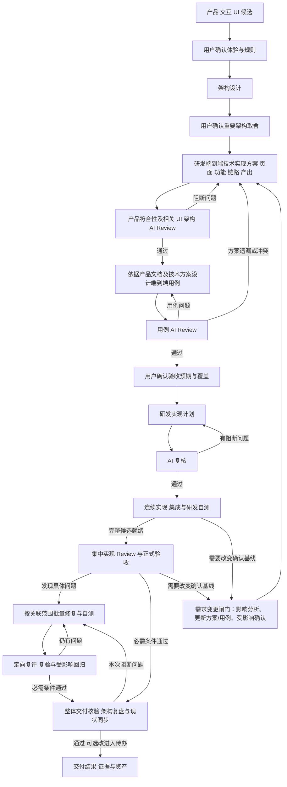

# 设计确认、计划复核与自主实现

日期：2026-10-10。共同执行协议，依据用户本次流程偏好维护。当前已定义指导，尚未通过真实功能验证整套执行。按任务范围使用：完整功能采用下面的确认与实现流程；已有有效基线的修复和局部变更复用既有确认，不重新走全套审批。用户与宿主当前指令优先。

含界面功能确认相关产品/交互/UI 成果；后端、CLI、配置或其他工程按实际对象选择适用的设计与用例，无关阶段注明不适用，不额外制造 UI 或设计审批。

具体任务的步骤与裁剪见[任务路由](task-routing.md)：bugfix 复用有效预期与确认，仅在改变基线时重新确认受影响部分；正常需求采用下述完整流程。

## 用户确认的范围

| 成果 | 用户确认什么 | 需要保留的基线 |
| --- | --- | --- |
| 产品、交互与 UI | 用户任务、业务规则、核心流程、状态和恢复、目标设备及相关视觉方向 | 产品/视觉规格、原型及有效 RULE/AC、版本和确认范围 |
| 架构设计 | 系统与模块边界、数据与接口、权限、运行/交付方式、重要技术选择及成本/兼容约束 | 可实现的架构设计、契约与重要决定；不要求用户核对每个内部文件和代码细节 |
| 测试用例及端到端覆盖 | 用普通语言确认可观察的正常、边界、拒绝、异常与恢复结果、拟交付功能和必要回归、覆盖边界及重要约束的影响；技术拆解由 AI Review 对齐 | 经 AI Review 的用户用例及技术拆解版本、稳定 TC/检查编号、关联技术方案与 RULE/AC/UI/ARC、操作/预期及覆盖边界；详细映射和执行方法保存在技术层 |

确认可以分步进行，也可合并展示相关候选；合并时仍需完成技术方案与用例 Review，并将重要架构决定纳入明确确认，不能跳过依赖或把尚未作出的决定登记为已确认。完整候选先具备可审阅的当前项目文档、原型/示例和真实预览再请求确认，明确项目归属、对应产品/设计UI/技术/方案/用例入口、待决问题和变化影响；按[项目文档协议](design-document-contract.md)定位实际成果，通用 Skill 参考不作为项目确认基线。已有明确用户决定只记录并复用；候选、Agent 自查、用户查看页面或未答复都不能登记为已确认。

确认记录保存成果位置、有效版本/提交或哈希、范围、用户确认来源及尚未确定的事项。关键设计变化只重新确认受影响部分。早期架构可行性和测试可验证性检查可以反向调整设计，必要时准备小型实验；受影响的正式实现以有效确认基线为依据。

专业规格的内容要求由[产品](../../dev-product/references/specification-contract.md)与[视觉](../../dev-visual/references/specification-contract.md)维护；本协议只定义确认、Review、依赖及自主实施边界。

## 架构之后：端到端技术实现方案与 Review

完整功能默认顺序为：产品/交互/UI 并确认 → 架构设计并确认重要取舍 → 研发输出端到端技术实现方案 → 产品符合性及相关 UI/架构 AI Review → 测试用例 → 用例 AI Review → 用户确认验收预期 → 研发实施计划及 AI 复核 → 连续实现、集成与研发自测、完整候选集中 Review/验收及实际交付。

研发按[技术方案方法](../../dev-engineering/references/technical-delivery-design.md)列明新增/修改/复用的页面或实际入口、功能与稳定 OUT、用户/调用者链路、接口/模块/数据/权限、状态/异常恢复及技术交付产物。关联有效产品 RULE/AC、流程/UI 和 ARC，从入口动作一直说明到可观察结果及必要服务端读回/副作用；无 UI 或无后端按实际对象裁剪。方案阶段明确计划与现状，必要实验保持实验范围，正式编码在后续确认和计划复核后开展。

产品依据原始规格双向核对覆盖和行为符合性，相关页面/状态由视觉核对，架构检查契约/依赖与重要约束。实际 AI Review 记录版本、执行者/方式、问题与结论；阻断项修正并定向复核通过后交测试。技术方案默认不新增人工审批，已有有效决定直接复用；改变确认基线只确认受影响部分。

## 端到端用例、AI Review 与人工确认

用户用例用普通中文描述场景、前置、操作和具体可观察结果；关联技术拆解承接接口/数据/并发/自动化与证据，独立架构专项保留约束来源。两层以稳定用例编号关联，技术层引用业务预期；用户无需审阅内部执行细节。用例 AI Review 同时核对用户可读性与两层覆盖、预期、证据和环境边界的一致性，不增加人工技术审批。具体方法与模板由[测试策略](../../dev-acceptance/references/strategy-and-cases.md)维护。

测试同时读取原始产品/交互/UI、架构和经 Review 的技术方案，从拟交付页面/入口/功能/链路形成可读端到端用例，并补足相关边界、拒绝、失败恢复、交付和必要架构检查。建立 `RULE/AC/UI/ARC ↔ OUT/链路 ↔ TC ↔ 自动化/实际证据`。产品要求未进入技术方案时作为遗漏反馈研发/产品，不以方案清单代替需求全集或缩减验收；测试可在设计早期提供场景/可测性意见，不因此提前定稿或接管原型走查。

用例交用户之前实际完成一次 AI Review：对照产品规则、技术产出、UI/ARC 检查覆盖、预期是否忠实、步骤/数据/依赖是否可执行、是否真正从入口验证结果、Mock/目标环境和未覆盖是否清楚。测试主责修订，主 Agent 组织产品/研发/架构相关视角复核；可用且获准委派时采用独立上下文，否则登记主 Agent AI 自查，不声称独立。记录用例/输入版本、发现与通过/阻断结论，修正阻断项并定向复核。

Review 通过后向用户展示拟交付页面/功能/链路、可读用例与覆盖/待决，明确请求确认场景和预期，保存确认来源及版本。未确认的必需决定不能进入依赖它的正式编码；可继续独立调查、候选准备和其他已授权工作。已有有效确认复用，局部修复在既有规格/用例内只更新受影响部分。

## 实施中的需求变更闸门

用户反馈、新证据或实现发现使原计划增加、删除或改变前置条件、入口操作、业务规则、可观察结果、失败恢复、接口/数据契约或交付边界时，不能继续把它当作原基线下的普通实现步骤。先判断变化范围，再只对受影响部分回退到设计、方案、用例和确认环节；无关范围可以继续准备和实现。

| 变化类型 | 典型信号 | 继续实现前的最低动作 |
| --- | --- | --- |
| 不改变用户行为或验收含义 | 内部重构、选择器/测试脚本、格式、非行为性环境修复 | 保持原基线，做受影响的局部验证并记录裁剪理由 |
| 改变用户行为或验收含义 | 新增/否定前置条件、入口、规则、成功/拒绝结果或恢复方式 | 更新受影响 RULE/AC、OUT/链路、TC/技术拆解和实施计划；完成 AI Review；需要人决定时确认受影响部分 |
| 改变系统契约或交付风险 | 接口/数据/权限/兼容/迁移/部署/外部依赖变化 | 除上项外更新 ARC/契约、迁移/恢复与运行验证；安排相应集成或真实 E2E |

变更闸门的固定顺序是：

`识别变化 → 标记旧基线受影响 → 影响分析 → 更新规则/方案/用例/计划 → AI Review → 受影响确认 → 继续实现 → 当前候选定向 E2E/回归`

行为用例和通过条件必须先于受影响实现固定；自动化脚本、夹具、环境和可行性实验可以并行准备，但不能用“实现完成后补文档”代替用例先行。若变化改变核心任务的入口、前置或最终结果，至少安排一条真实入口到结果的 E2E；具体触发条件和裁剪方式按[测试与验收 Skill](../../dev-acceptance/SKILL.md)执行。变更期间不得以旧用例、旧候选或局部测试通过报告完整完成。

## 实施计划与一次 AI 复核

研发在用例 AI Review 与用户确认之后产出可执行实施计划，关联已确认产品/视觉、架构、经 Review 的技术方案 OUT 和已确认 TC 的版本。计划至少说明本次范围、可运行切片与依赖、主要变更位置、接口/数据变化、研发自测、完整候选交接与集中验收和交付启动方式；相关迁移、兼容和恢复按任务补充。小任务可直接在任务记录中表达，不重复生成同义文档。

计划由 AI 在实施前明确复核一次，不增加人工实现计划审批。复核依据原始有效规格和实际工程，检查：

- 计划覆盖相关规则、架构约束、测试用例与约定交付；任务依赖和写入范围能够成立。
- 工程入口、技术选择与实际依赖可用；重要未知项有对应验证，不凭假设保证可行。
- 关键结果有真实检查方式，相关数据、权限、失败/恢复和兼容约束有落实位置。
- 计划未暗改用户确认的行为、重要架构取舍或验收预期；必要变化回到对应设计确认。

可用且获准委派时，优先由独立 AI 评审上下文复核，具体执行者与模型遵循用户和宿主设置。不能委派时，由主 Agent 单独执行并记录 AI 自查，不能声称独立复核；用户明确要求独立评审时依该要求执行。架构/测试等职责尚未建成时明确实际承担者。

记录计划版本、所依据的基线、实际复核方式、结论和问题。阻断问题由 AI 修正并定向复核，通过后直接开始已授权范围的实现。不能把评审人的名称或配置存在当作已执行复核。实施中普通步骤调整和缺陷修复更新计划；新证据使计划的重要假设失效时，AI 定向重审受影响部分。

## 自主实现、调整与端到端验收

此图表达完整功能的依赖，实际确认可合并，已完成阶段直接复用。研发按内部切片连续实现、集成和自测，完整候选就绪后集中 Review 与正式验收；等待用户确认时继续不依赖该决定的调查、候选准备与其他授权工作。

### 实施与正式验收的边界

内部切片和模块是研发组织单位，不是独立交付或验收门槛。研发随实现执行必要类型、构建、契约、局部回归和真实主链路自测，尽早暴露集成问题；测试可提前准备已确认用例、数据、自动化与环境，但不因一个模块可运行就启动一轮独立正式验收或实现 Review。前置设计确认、技术方案 Review、用例 Review/确认和实施计划 AI 复核仍保留。

只有用户明确要求阶段交付，或后续实现依赖关键可行性、数据、权限、兼容风险的结论时，才提前开展专项检查。记录具体目的、范围和停止条件，避免将专项扩大成例行切片门槛。局部修复按实际影响形成完整修复候选，不要求重做全产品实现。

### 完整候选交接条件

- 已确认的本次范围已实现，必要入口、模块与消费者已集成，核心用户/调用者任务可真实运行。
- 必需能力未由占位、硬编码成功或 Mock 替代；实验、模拟及未覆盖边界明确。
- 适用的类型、构建、局部回归和完整主链路研发自测已通过；真实阻断问题先由研发处理。
- 受影响的 RULE/AC、OUT/链路、TC/技术拆解和实施计划版本已经同步；适用的 E2E 触发项已在当前候选真实入口执行，未执行或阻塞项不能登记为完整候选就绪。
- 候选版本及相关未提交差异、启动入口、实际自测和已知问题清楚，可供 Review 与验收重复执行。

### 集中检查与修复

实现 Review 核对从任务基线到完整候选的全部变更、需求覆盖及实现质量；正式验收按已确认用例验证真实任务。两者可以针对同一固定候选并行；界面、API、数据与专项检查支撑同一整体结论，不分别要求用户验收。

发现具体缺陷立即反馈，不等所有检查结束才开始修复。研发按共同根因和关联范围批量处理，同时补足相邻契约与受影响回归；反复出现相关问题时检查共享状态、不变量、派生数据和上下游契约。检查者继续验证固定候选，研发推进下一候选；需要时隔离快照/worktree及运行数据。无法隔离时暂停受影响检查并切换明确版本，不冻结全部实现或使用变化中的候选给出稳定结论。

修复后定向复评原意见、复验原问题和相邻契约/受影响回归，只有新影响才扩大覆盖。最后做整体集成与交付核验，复用内容和环境均未变化的有效结果，不机械重跑全部检查。具体记录沿用现有 tracker 和下述最小验证记录。

### 最小验证记录

默认记录候选提交及相关未提交差异、必要环境/入口、实际命令或步骤、结果和未覆盖范围，直接引用现有 runner 输出。缺陷补充最小复现、预期/实际、修复版本和复验结果；小任务合并在既有记录中，不重复建账本。

截图、资源哈希、逐文件指纹和视觉基线仅在相关问题确需证明时补充；不默认做多尺寸截图遍历、全源码哈希清单、独立证据合规 Review 或新建取证工具。历史整理与工具维护默认在交付后处理；用户明确要求或工具错误确实阻断必需判断时，才纳入本轮。

### 主会话的运行与结束

主 Agent 派发子任务后继续负责执行、集成和整体交付：有独立工作就推进；没有可推进工作就使用宿主实际等待工具，收到阶段结果后核验、集成或继续等待。派发成功、子任务完成、一次等待超时或用户询问进度均不代表整体完成，不能据此直接给出 final 并结束主会话。

只在整体目标完成、用户明确暂停/停止，或自主调查后确实需要用户决定/资源才能继续时交还本轮；阻塞要说明已查事实、具体缺口和可恢复入口。平台强制中断时保存当前候选、剩余工作和恢复方式，不将中断登记为交付完成。

Agent 可以自主调整内部实现、任务切分、诊断与修复方法，补充真实测试数据和脚本，修正选择器/测试环境等执行问题；保留已经确认的业务、架构与验收含义。改变架构内部实现但不改变确认约束时，记录符合性和必要回归即可。不能通过删除场景、降低预期、扩大容差或把真实链路替换为模拟来关闭缺陷。

测试用例中的可观察预期由确认基线约束，自动化实现由 Agent 维护。发现用例错误或歧义时对照原始规格报告依据；调整已经确认的验收含义须请求具体确认。测试失败先核查实现、测试执行和环境，按实际根因修复；重复失败回到诊断，不机械重跑或擅自降低要求。

最终在当前候选的真实启动/安装/部署环境执行约定端到端链路，检查实际操作、相关持久化、异常与恢复、视觉/交互以及可启动交付。端到端结果作为交付主线，架构约束同时通过相应契约、集成、数据、权限或性能检查证明；用例策略按项目风险定义，不强制所有验证都塞进浏览器测试。

架构按[专业方法](../../dev-architecture/SKILL.md)检查相关实现与必需契约，并在实质研发结束后基于当前源码和实际验收结果完成定向复盘：更新系统与目录模块地图、业务域/层次和模块分工，评价合理性、登记有证据的建议。可与交付核验合并；局部任务裁剪范围，不新增人工计划确认。复盘发现本次必需条件不成立时继续修复/复验，可选演进进入待办。

只有当前必需条件通过、阻断问题关闭、实际交付成立，才能给出完成结论。用户不需要逐步复核代码或实现计划，最终获得可用成果与证据，可继续提出体验反馈。基线确认不会自动扩大外部动作权限；环境缺失先自主排障，无法取得必要资源时报告对应缺口，不能登记为验收通过。

## 分支集成与执行者

工程时序按[分支/worktree、验证与合并建议](git-and-worktree.md)，是否委派按[subagent 使用建议](subagent-guidance.md)。这些选择支持上述阶段依赖，不能用分支、PR 或子 Agent 完成状态替代有效确认、实际 Review 与当前候选验证。独立上下文只在获准且实际可用时采用，不能委派则如实记录自查；推送/合并与发布按已有动作授权执行，不额外增加人工计划审批。

## 项目沉淀与新上下文

优先使用已有权威位置；本次阶段产物按同一迭代集中维护。新上下文先从 `docs/dev-flow/index.md` 找到 `iterations/<迭代ID>/index.md`，再读取相关长期基线；默认按需采用：

| 资产 | 默认位置 |
| --- | --- |
| 产品/视觉规格、原型和检查 | [共同设计文档协议](design-document-contract.md)的目录 |
| 当前架构入口与本次设计 | `docs/dev-flow/architecture/index.md`、`docs/dev-flow/iterations/<迭代ID>/architecture/design.md` |
| 实际模块地图与架构复盘 | `docs/dev-flow/architecture/modules.md`、`docs/dev-flow/iterations/<迭代ID>/architecture/review.md`；详见[架构资产协议](../../dev-architecture/references/project-assets.md) |
| 端到端技术实现方案与 AI Review | `docs/dev-flow/iterations/<迭代ID>/engineering/technical-solution.md`；页面/入口/功能/OUT/链路、产品符合性及相关 UI/架构复核 |
| 用户用例、技术拆解与 AI Review | `docs/dev-flow/iterations/<迭代ID>/acceptance/cases.md` 保存行为与确认；`acceptance/technical-checks.md` 保存技术映射与对齐 Review；自动化在项目实际测试目录维护 |
| 实现计划与 AI 复核 | `docs/dev-flow/iterations/<迭代ID>/engineering/implementation-plan.md`；复核记录可放同文件，重要问题按需独立保存 |
| 确认与变更 | 记录在对应规格/设计/用例中，由项目索引关联，不依赖本机临时缓存 |

索引关联有效版本、确认来源、计划/复核、自动化入口、候选版本、缺陷和证据。新上下文先恢复这些事实，再继续执行；不因实现更新就把过期证据改写为当前通过。普通历史由 Git 保存，已替换完整方案按项目约定归档。

测试验收的具体方案与执行使用[专业 Skill](../../dev-acceptance/SKILL.md)，项目策略/用例、逐轮报告和缺陷按[测试资产协议](../../dev-acceptance/references/project-assets.md)维护。真实接口/数据、界面交互、前后端 E2E 与交付分别取证，Mock 覆盖、跳过和不稳定项不自动升级为当前候选的完整通过。

研发的基线恢复、切片/实现、证据诊断与待验交接按[专业 Skill](../../dev-engineering/SKILL.md)执行，实现计划与实际 AI 复核、工程/代码映射及可启动支持按[工程资产协议](../../dev-engineering/references/project-assets-and-delivery.md)维护。研发自测与测试验收分别取证，不新增人工实现计划审批。

运维的环境/启动、产物/发布、运行与恢复按[专业 Skill](../../dev-operations/SKILL.md)执行，长期运行资料按[运行资产协议](../../dev-operations/references/project-assets-and-evolution.md)维护。当前目标版本和核心任务实际核验，外部动作依已有授权，结果未知先查询；运维运行证据与测试验收分别登记。
