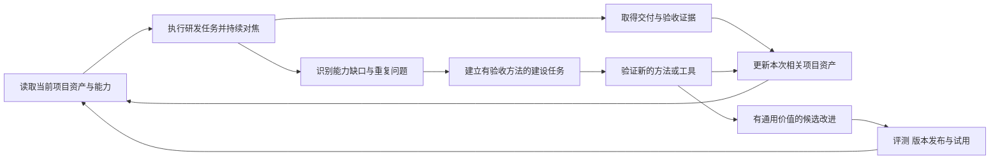

# 项目资产与持续沉淀

适用于任务开始的资产检索、变更后的定向维护、交付交接和后续复用核验。项目事实保存在所属项目；通用方法保存在 Skills；单次执行证据关联实际候选版本。仅维护本次相关内容。

## 每个项目持续维护的资产

项目资产直接支持下一次工作，来源以现有工程和有效决策为准。已有文档、组件、测试和脚本优先作为权威来源，通过索引引用，避免复制出第二份相互冲突的版本。

| 项目资产 | 主责 | 内容与更新触发 |
| --- | --- | --- |
| 项目现状和工作入口 | 协调者，六角色补充 | 项目目标、当前交付方式、源文件与运行入口；接入和实际结构变化时更新 |
| 产品与交互基线 | 产品 | 核心流程、业务规则、验收目标、已确认决定和当前反馈；需求和行为变化时更新 |
| 设计系统与界面基线 | 视觉 | Tokens、组件、状态、目标设备、当前实际界面；组件与界面变化时更新 |
| 系统与技术契约 | 架构 | 模块、接口、数据不变量、依赖与架构决策；契约和结构变化时更新 |
| 工程方案/地图和可复用工具 | 研发 | 页面/功能/OUT/链路的技术方案及符合性 Review、代码位置、约定/构建入口与有效方法；需求/工程/工具变化时更新 |
| 场景与回归资产 | 测试验收 | 综合产品/技术方案的验收场景及 AI Review/人工确认、数据、历史缺陷、自动化及覆盖缺口；新增行为和问题修复时更新 |
| 交付与运行资产 | 运维 | 环境、启动安装发布方式、观测、恢复和故障手册；交付和运行条件变化时更新 |
| 能力账本与改进待办 | 协调者汇总，各部分主责维护 | 本项目各能力的有效状态、证据、缺口、建设任务和改进效果 |

项目采用统一的六角色索引，但不要求一次创建全部目录或把每份产物放进新目录。没有界面的项目可以标明相关视觉能力不适用；某能力缺少验证时标为待建设或证据不足。

### 持久资产与临时运行数据

优先使用项目现行文档位置；没有约定时，以 `docs/dev-flow/index.md` 作为入口，关联迭代列表与跨迭代有效资产；每轮阶段产物在 `iterations/<迭代ID>/` 集中保存，由该迭代索引关联产品、UI、架构、工程、验收和运维成果。目录、文档状态和归档遵守[项目文档协议](design-document-contract.md)，不另建平行的权威索引。

长期文档、源码、测试和必要证据纳入项目版本管理；`.dev-flow/` 只保存忽略的本机服务记录、缓存和临时日志。持久证据不能只指向可能被清理的缓存。可复用资产与能力状态可在现行索引或已有账本中登记，本协议不要求新增 JSON 账本、数据库或专用查询服务。

长期文档与独立事件可以直接维护，不要求建立迭代。历史梳理、总结和归档遵守[文档整理与归档](document-archive.md)：先同步有效资产与承接遗留，再逻辑归档；保留仍有效的历史规格入口和原始结论。定时检查需独立的调度授权。

外部设计文件和运行资料可以作为权威来源索引，保存访问位置、版本及必要的范围。无法访问时保留限制，不凭旧摘要覆盖当前真实来源。凭据使用项目既有的保管方式，项目资产只记录必要配置与取得方式。

### 资产记录与变更关系

每条可复用资产记录编号、类型、主责、权威位置、来源版本、适用范围、关联需求与能力、验证证据、有效性和替换关系。来源改变时识别受影响资产；当前有效、待核验、候选与已废弃的内容分别记录。

维护需求、交互与组件、代码与契约、测试与缺陷、交付与运行之间的依赖。例如组件状态改变需要重新核验相关界面与交互用例；接口改变可能影响页面、测试数据和运行说明。只更新受影响资产，无法确定影响时先核查。

没有变更且仍有效的资产直接引用，不为每次任务复制一份。新任务读取相关索引与必要资产，不把全部项目历史塞入每个角色上下文。

## 持续沉淀的工作循环

### 任务开始

读取项目目标和有效配置，按角色和任务检索相关资产。核对来源版本、环境与当前事实是否一致，记录本次使用的资产版本。可以继续使用的资产直接复用；需要更新的相关资产作为任务内容；无关缺口进入建设待办。

### 每轮研发测试

新增场景与缺陷关联验收条件和候选版本，研发修复后由测试复验。设计、契约、数据或运行条件变化时更新对应专业资产或候选变更，保持本轮所有角色面对相同有效输入。尚未证实的原因和方法作为候选，不能直接成为现行规范。

### 交付与沉淀

每个启用角色报告资产变化：复用哪些资产、更新哪些事实或产物、形成哪些可复用经验、发现哪些能力缺口。没有新的有价值内容时允许报告仅复用或无需更新，不强制生成复盘文件。

完成必要的相关资产更新后记录本次实际交付、输入和成果版本、验收证据及后续事项。未完成沉淀时分别报告“成果已验收，相关资产待更新”，不能把产品功能重新标为失败，也不能宣称本次完整交付及沉淀工作均已结束。

只围绕本轮授权范围更新项目资产。与当前交付无关的组件推广、平台升级、通用技能改写或长期研究进入建设待办，避免沉淀扩大研发任务。持续建设通过后续已授权任务和复盘触发；定时执行属于单独的调度能力，不随普通资产维护自行创建。

### 后续任务验证复用

后续任务需要实际使用上一轮产物，例如复用组件、运行回归用例、按已验证入口启动、根据当前接口或决策继续开发。记录复用是否减少重复调查、是否仍满足结果，而不是只统计新增文档数。

## 能力成熟度与有效性

能力成熟度与当前项目有效性分别管理。曾经验证过的能力可能因项目或环境变化需要重新核验，不能因为等级较高就永久信任。

| 成熟度 | 含义 | 必需依据 |
| --- | --- | --- |
| M0 已定义 | 存在清晰能力契约，尚未证明实际执行 | 输入、判断、产物、验收方式与适用边界 |
| M1 项目已验证 | 在明确项目与环境中执行成功 | 可定位的成果、实际证据和可复现方法 |
| M2 可复用 | 已证明在声明范围内可重复使用，边界已验证 | 代表场景、适用与不适用条件、有效复用和回归案例 |
| M3 持续维护 | 有稳定的回归、变更核验和版本演进机制 | 回归结果、失效处理、维护责任和升级或回退记录 |

M3 不要求全部专业判断自动化。产品可用性和视觉质量等仍需要适当的实际检查，自动化负责可重复部分和漂移信号。

需要能力现状管理时，在项目现行索引或已有账本按[能力编号](role-capabilities.md)记录成熟度、当前有效性、使用的通用能力版本、项目资产、最近实际证据、限制和建设待办。未观察过的能力记未知；不适用与尚未具备分别记录，不把没有证据写成已经验证。

体系可以汇总“能力 × 项目”的覆盖矩阵，每格显示当前成熟度、有效性和证据入口。它用于识别哪些项目能复用什么、下一项能力在哪里验证，不用一个平均分掩盖关键交付能力缺失。

来源、工具、环境、验收规则或适用范围变化触发相关能力重新核验。不能只刷新“最后检查日期”来保持有效状态。项目长期未运行时根据其实际风险提示核验，不设所有资产统一的机械有效期。

## 从项目经验提升通用能力

通用能力迭代采用：**观察问题 → 项目内验证 → 提出候选方法 → 验证适用范围与边界 → 更新 Skill 或工具 → 行为评测 → 版本发布 → 项目试用**。

只有项目内成立的经验先保留在该项目；通用候选需要说明可以帮助哪些任务，避免把特定组件风格、一次故障的偶然条件或用户偏好升级为全局要求。

每项通用改进有来源问题、主责、预期收益、操作变化、验收案例和采用范围。评测包含代表性成功场景及有意义的边界或不适用场景；复核读取原始任务与产物，不预填期望判断。

常规资产维护在既有任务授权内推进。涉及更改用户确认的产品取舍、扩大外部动作范围或环境要求批准时请求具体决策。项目采用新通用版本前检查与现行需求、实现和工具的兼容性；试用失败时回退方法版本，保留实际有效的项目成果。

建设待办按交付影响、出现频率、风险和投入排序。每项待办明确问题证据、能力编号、目标、产物、验收方式、主责和依赖。重复问题优先提炼为回归、组件或工具；一次问题先修正最窄的实际原因，不积累无依据的通用限制。

## 示例 从一次保存失败修复到持续复用

以下为行为设计示例，不代表已在任何项目运行。

任务要求一个编辑界面在保存失败后保留内容并允许重试：P04 定义状态与恢复语义，V03 定义组件呈现，A03 明确接口结果和适用的重复请求行为，E03 实现，T03 与 T07 操作复现、反馈和复验，O01 保证实际启动入口可用。

研发测试发现重试后界面仍处于加载状态。验收记录候选版本、步骤、预期、实际和操作证据；研发基于证据定位并修复；测试复验原场景和受影响路径。

本次项目沉淀包括当前交互状态、实际组件、接口规则、失败与重试回归、根因与诊断方法，以及已验证的启动配置。它们保留在各自权威位置，由项目索引关联到对应能力。

下一次任务增加自动保存时，入口检索这些资产，产品核对新行为与旧语义，研发复用有效组件和接口约定，测试执行旧的失败重试场景并补充新行为，运维复核实际启动配置。已有证据只在版本与依赖仍有效时复用。

若该方法在其他适用场景验证有效，再将“异步保存失败恢复的交互与验收方法”作为通用候选，提炼到产品、研发和验收的相关能力参考中，并提供边界案例。单个项目的具体文案、布局和业务规则保留在项目中。
